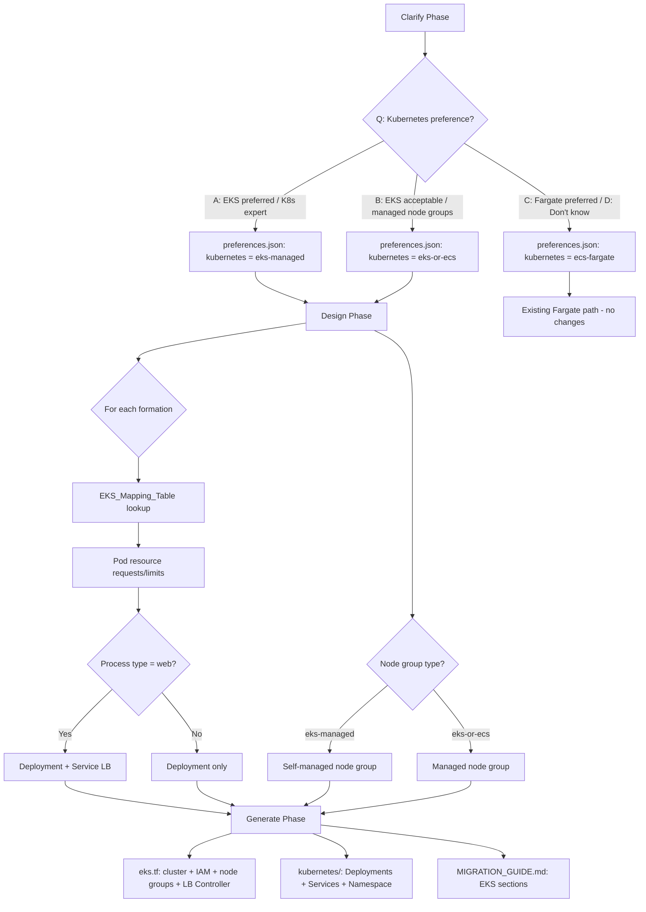
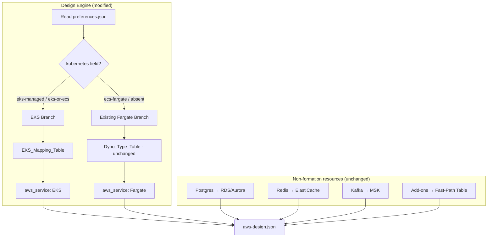

# Design Document: Heroku EKS Support

## Overview

This design adds EKS as an alternative compute target in the `heroku-to-aws` migration skill. When a user explicitly selects Kubernetes preference during the Clarify phase, all dyno formations map to EKS Deployments (with pod resource requests/limits) instead of Fargate task definitions. The Generate phase emits EKS Terraform (cluster, node groups, IAM) and Kubernetes manifests (Deployments, Services, Namespace) alongside the existing data-tier Terraform.

### Key Design Decisions

1. **Mirrors GCP skill pattern**: The Kubernetes preference question, `preferences.json` field name (`design_constraints.kubernetes`), and valid values (`eks-managed`, `eks-or-ecs`, `ecs-fargate`) are identical to the GCP skill's Q8 pattern. This ensures consistency across both skills and allows shared tooling to interpret the preference uniformly.

2. **All-or-nothing for formations**: When EKS is selected, ALL formation resources map to EKS. No mixed Fargate+EKS compute architecture. This avoids operational complexity of two container orchestrators.

3. **Single cluster design**: One EKS cluster hosts all formations. Multiple apps share the cluster via Kubernetes namespaces. This matches how teams typically operate Kubernetes in practice.

4. **Non-formation resources unaffected**: Postgres → RDS/Aurora, Redis → ElastiCache, Kafka → MSK, add-ons → Fast-Path Table. These mappings remain identical regardless of kubernetes preference.

5. **Deterministic table lookup**: The EKS_Mapping_Table uses the same philosophy as the existing Dyno_Type_Table — exact case-insensitive match, predictable output, error on unknown types.

6. **Default remains Fargate**: Unanswered or "I don't know" defaults to Fargate. EKS requires explicit user selection. This preserves the existing skill behavior as the safe default.

7. **Node group strategy driven by preference value**: `eks-managed` → self-managed node groups (more control for K8s experts), `eks-or-ecs` → managed node groups (less operational burden).

### Scope Boundaries

| In Scope                                                        | Out of Scope                                      |
| --------------------------------------------------------------- | ------------------------------------------------- |
| Kubernetes preference question in Clarify                       | Graviton/ARM64 node selection (deferred with Fir) |
| EKS Deployment mapping for all 7 dyno types                     | Fargate on EKS (serverless pods)                  |
| EKS cluster + node group Terraform generation                   | Custom Helm charts beyond LB Controller           |
| Kubernetes manifest generation (Deployment, Service, Namespace) | Service mesh (Istio, App Mesh)                    |
| AWS Load Balancer Controller for web services                   | Horizontal Pod Autoscaler configuration           |
| Pod-to-RDS/ElastiCache security group rules                     | Cluster autoscaler / Karpenter                    |
| IAM Roles for Service Accounts (IRSA)                           | Multi-cluster federation                          |
| Migration guide EKS sections                                    | GitOps (ArgoCD, Flux) setup                       |
| Property test updates                                           | EKS Anywhere or EKS on Outposts                   |

## Architecture

### Decision Flow



### Integration with Existing Design



## Components and Interfaces

### Modified: Clarify Engine

**Change**: Add Kubernetes preference question to Batch 3.

**Question placement**: After existing containerization status question (Q11), before Fir intent (conditional). New question becomes Q12 in Batch 3. Batch 3 max moves from 5 to 5 (existing Q11–Q15 becomes Q11–Q16 with the new question inserted, but batch still contains ≤5 questions since Fir intent is conditional and only fires when Fir detected).

**Question definition**:

```
Q12 — Kubernetes preference

Fire when: Always (all stacks). This is a subjective team-expertise question.

Context for user:
> Your choice determines whether we deploy containers to EKS (Kubernetes) or 
> ECS Fargate (simpler managed containers). EKS gives you more control but 
> requires Kubernetes operational expertise. Fargate eliminates cluster 
> management entirely.
>
> A) EKS preferred — team has Kubernetes expertise, wants full K8s control
> B) EKS acceptable — team can operate K8s, prefers managed node groups
> C) ECS Fargate preferred — simplest managed containers (default)
> D) I don't know

Interpret:
A -> design_constraints.kubernetes: "eks-managed"
B -> design_constraints.kubernetes: "eks-or-ecs"  
C -> design_constraints.kubernetes: "ecs-fargate"
D -> design_constraints.kubernetes: "ecs-fargate" (same as default)

Default: C -> "ecs-fargate"
```

**preferences.json output** (additions to existing schema):

```json
{
  "design_constraints": {
    "kubernetes": "eks-managed | eks-or-ecs | ecs-fargate"
  }
}
```

### Modified: Design Engine

**Change**: Add EKS branch that fires when `design_constraints.kubernetes` is `"eks-managed"` or `"eks-or-ecs"`.

**EKS design logic** (replaces Fargate mapping for formations only):

1. Read `preferences.json → design_constraints.kubernetes`
2. If value is `"eks-managed"` or `"eks-or-ecs"`:
   - For EACH formation resource: look up dyno type in EKS_Mapping_Table → produce EKS Deployment entry
   - Produce single EKS cluster entry with node group type based on preference
   - Web processes get a Kubernetes Service (type: LoadBalancer) entry
3. If value is `"ecs-fargate"` or absent: existing Fargate path (unchanged)

**EKS service entry in aws-design.json**:

```json
{
  "service_id": "eks:my-web-app:web",
  "source_resource_id": "formation:my-web-app:web",
  "heroku_app": "my-web-app",
  "aws_service": "EKS",
  "confidence": "deterministic",
  "aws_config": {
    "region": "us-east-1",
    "cluster_name": "heroku-migration-cluster",
    "namespace": "my-web-app",
    "deployment_name": "web",
    "replicas": 2,
    "container_image": "placeholder:my-web-app-web",
    "process_type": "web",
    "resources": {
      "requests": { "cpu": "250m", "memory": "512Mi" },
      "limits": { "cpu": "500m", "memory": "512Mi" }
    },
    "load_balancer": true,
    "node_group_type": "managed"
  }
}
```

**EKS cluster entry in aws-design.json** (new section):

```json
{
  "eks_cluster": {
    "cluster_name": "heroku-migration-cluster",
    "kubernetes_version": "1.30",
    "node_group_type": "managed | self-managed",
    "node_groups": [
      {
        "name": "general",
        "instance_types": ["m6i.xlarge"],
        "min_size": 2,
        "max_size": 10,
        "desired_size": 3
      }
    ],
    "addons": ["vpc-cni", "coredns", "kube-proxy", "aws-load-balancer-controller"]
  }
}
```

### New: EKS Mapping Table (`design-refs/eks-mapping-table.md`)

| Heroku Dyno Type | Pod Request CPU | Pod Request Memory | Pod Limit CPU | Pod Limit Memory | Recommended Node Type |
| ---------------- | --------------- | ------------------ | ------------- | ---------------- | --------------------- |
| standard-1x      | 250m            | 512Mi              | 500m          | 512Mi            | m6i.large             |
| standard-2x      | 500m            | 1024Mi             | 1000m         | 1024Mi           | m6i.large             |
| performance-m    | 1000m           | 2560Mi             | 2000m         | 2560Mi           | m6i.xlarge            |
| performance-l    | 4000m           | 14336Mi            | 8000m         | 14336Mi          | m6i.4xlarge           |
| private-s        | 500m            | 1024Mi             | 1000m         | 1024Mi           | m6i.large             |
| private-m        | 1000m           | 2560Mi             | 2000m         | 2560Mi           | m6i.xlarge            |
| private-l        | 4000m           | 14336Mi            | 8000m         | 14336Mi          | m6i.4xlarge           |

**Design rationale**:

- CPU requests match documented dyno shares (standard-1x = 1 share ≈ 250m of a core)
- Memory requests match documented dyno memory exactly
- CPU limits are 2x requests to allow bursting (Heroku dynos can burst above their share)
- Memory limits equal requests (prevents OOM from over-allocation — Kubernetes kills pods exceeding memory limits)
- Node types accommodate ≥4 pods per node with overhead: kubelet (~100m CPU, 256Mi), kube-proxy (~100m, 128Mi), VPC CNI (~10m per ENI)

**Node group sizing logic**:

- Calculate total requested CPU/memory across all formations
- Select instance type where: (instance_capacity - system_overhead) ≥ total_requests / desired_node_count
- System overhead per node: 500m CPU, 512Mi memory (kubelet + kube-proxy + VPC CNI + DaemonSets)
- Minimum 2 nodes for HA, maximum derived from total pod count ÷ 4

### Modified: Generate Engine

**Change**: When design contains `aws_service: "EKS"`, produce EKS-specific artifacts.

**New files generated**:

1. **`terraform/eks.tf`** — EKS cluster, node groups, IAM:
   ```hcl
   # EKS Cluster
   resource "aws_eks_cluster" "main" { ... }

   # IAM Role for EKS Cluster
   resource "aws_iam_role" "eks_cluster" { ... }

   # IAM Role for Node Group
   resource "aws_iam_role" "eks_nodes" { ... }

   # Node Group (managed or self-managed based on preference)
   resource "aws_eks_node_group" "general" { ... }  # managed
   # OR
   resource "aws_autoscaling_group" "eks_nodes" { ... }  # self-managed

   # OIDC Provider for IRSA
   resource "aws_iam_openid_connect_provider" "eks" { ... }

   # AWS Load Balancer Controller (Helm)
   resource "helm_release" "aws_lb_controller" { ... }
   ```

2. **`kubernetes/namespace.yaml`** — Namespace per app:
   ```yaml
   apiVersion: v1
   kind: Namespace
   metadata:
     name: <heroku-app-name>
   ```

3. **`kubernetes/<app>-<process-type>-deployment.yaml`** — Per formation:
   ```yaml
   apiVersion: apps/v1
   kind: Deployment
   metadata:
     name: <process-type>
     namespace: <heroku-app-name>
   spec:
     replicas: <quantity>
     template:
       spec:
         containers:
         - name: <process-type>
           image: <placeholder>
           resources:
             requests:
               cpu: "<from table>"
               memory: "<from table>"
             limits:
               cpu: "<from table>"
               memory: "<from table>"
   ```

4. **`kubernetes/<app>-<process-type>-service.yaml`** — For web processes only:
   ```yaml
   apiVersion: v1
   kind: Service
   metadata:
     name: <process-type>
     namespace: <heroku-app-name>
     annotations:
       service.beta.kubernetes.io/aws-load-balancer-type: "external"
       service.beta.kubernetes.io/aws-load-balancer-nlb-target-type: "ip"
       service.beta.kubernetes.io/aws-load-balancer-scheme: "internet-facing"
   spec:
     type: LoadBalancer
     selector:
       app: <process-type>
     ports:
     - port: 80
       targetPort: <app-port>
   ```

**MIGRATION_GUIDE.md additions** (inserted after Prerequisites, before Data Migration):

```markdown
## EKS Cluster Setup

1. Apply EKS Terraform: `terraform apply -target=module.eks` (or `terraform apply` if not modularized)
2. Configure kubectl: `aws eks update-kubeconfig --name heroku-migration-cluster --region <region>`
3. Verify node group: `kubectl get nodes` — confirm all nodes are `Ready`
4. Verify LB Controller: `kubectl get deployment -n kube-system aws-load-balancer-controller`

## Deploy Workloads to EKS

1. Create namespace: `kubectl apply -f kubernetes/namespace.yaml`
2. Deploy workloads: `kubectl apply -f kubernetes/`
3. Verify pods: `kubectl get pods -n <namespace>` — confirm all pods are `Running`
4. Verify load balancer (web services): `kubectl get svc -n <namespace>` — confirm EXTERNAL-IP provisioned

## Configure Pod-to-Service Access

1. Create IAM Roles for Service Accounts (IRSA) for pods that need AWS service access (RDS, ElastiCache, MSK)
2. Verify security group rules: pods must reach RDS on port 5432, ElastiCache on port 6379, MSK on port 9092
3. Store connection strings in Kubernetes Secrets: `kubectl create secret generic db-credentials --from-literal=...`
4. Reference secrets in Deployment env vars or use external-secrets-operator for Secrets Manager integration
```

### Modified: Property Tests

**Property 22 update**: The existing "No EB/App Runner in design" property needs amendment:

**Current behavior**: Rejects `"Elastic Beanstalk"`, `"App Runner"`, `"ECS Express Mode"` as `aws_service` values unconditionally.

**New behavior**:

- Still rejects `"Elastic Beanstalk"`, `"App Runner"`, `"ECS Express Mode"` unconditionally
- Accepts `"EKS"` for formation resources ONLY when `preferences.json → design_constraints.kubernetes` is `"eks-managed"` or `"eks-or-ecs"`
- Rejects `"EKS"` when `kubernetes` is `"ecs-fargate"` or absent

**New property (Property 23): EKS mapping preserves dyno specifications**:

- Generate random formations with recognized dyno types + kubernetes preference set to `"eks-managed"` or `"eks-or-ecs"`
- Verify: pod request cpu/memory ≥ dyno documented capacity, replicas = source quantity (0–100), LoadBalancer Service iff web, all formations use EKS (no mixing)

**New property (Property 24): EKS selection consistency**:

- Generate random inventories with kubernetes preference set to `"eks-managed"` or `"eks-or-ecs"`
- Verify: every formation resource has `aws_service: "EKS"`, non-formation resources have their existing targets (RDS, ElastiCache, MSK), single EKS cluster in design

## Data Models

### EKS_Mapping_Table (New)

Stored at `references/design-refs/eks-mapping-table.md`. Same structural format as existing `dyno-type-table.md`.

**Lookup rules**:

1. Input: dyno type string (case-insensitive)
2. Exact match → return pod requests/limits + recommended node type
3. No match → error (same rejection pattern as Dyno_Type_Table)

### preferences.json (Modified)

Added `design_constraints` section:

```json
{
  "design_constraints": {
    "kubernetes": "eks-managed | eks-or-ecs | ecs-fargate"
  }
}
```

This field name and values are intentionally identical to the GCP skill's preference to enable shared interpretation logic.

### aws-design.json (Modified)

**New valid value for `aws_service`**: `"EKS"` (in addition to existing `"Fargate"`, `"RDS"`, `"Aurora"`, `"ElastiCache"`, `"MSK"`, etc.)

**New section**: `eks_cluster` object at top level (present only when EKS services exist in design)

**Modified `aws_config` for EKS entries**: Replaces `task_cpu`/`task_memory`/`desired_count` with `resources.requests`/`resources.limits`/`replicas`/`cluster_name`/`namespace`/`node_group_type`

## Correctness Properties

### Property 23: EKS mapping preserves dyno specifications (NEW)

**Type**: Invariant + Metamorphic

**Generator**: Random formations with recognized dyno types × kubernetes preference ∈ {`"eks-managed"`, `"eks-or-ecs"`}

**Assertions**:

- Pod request cpu (millicores) ≥ dyno documented CPU share equivalent
- Pod request memory (MiB) = dyno documented memory exactly
- Pod limit cpu = 2 × request cpu
- Pod limit memory = request memory
- `replicas` = source formation `quantity` (0–100)
- LoadBalancer Service present iff `process_type == "web"`
- `aws_service` = `"EKS"` for all formation entries

**Validates: Requirements 2.1, 2.2, 2.5, 2.6, 2.7, 2.8, 3.2, 3.3**

### Property 24: EKS selection is all-or-nothing for formations (NEW)

**Type**: Invariant

**Generator**: Random inventories (1–10 formations, 0–5 add-ons) × kubernetes preference ∈ {`"eks-managed"`, `"eks-or-ecs"`}

**Assertions**:

- Every formation-type resource has `aws_service: "EKS"`
- No formation-type resource has `aws_service: "Fargate"`
- Non-formation resources (postgres, redis, kafka, add-ons) retain their existing AWS targets regardless of kubernetes preference
- Exactly one `eks_cluster` entry in design
- Node group type matches preference: `"eks-managed"` → `"self-managed"`, `"eks-or-ecs"` → `"managed"`

**Validates: Requirements 2.3, 2.4, 7.1, 7.2, 7.3, 7.4**

### Property 22: No EB/App Runner in design output — EKS conditionally valid (MODIFIED)

**Type**: Invariant

**Generator**: Random inventories × random kubernetes preferences (including absent, `"ecs-fargate"`, `"eks-managed"`, `"eks-or-ecs"`)

**Assertions**:

- `aws_service` never contains `"Elastic Beanstalk"`, `"App Runner"`, or `"ECS Express Mode"` regardless of preferences
- `aws_service: "EKS"` appears for formations ONLY when `design_constraints.kubernetes` is `"eks-managed"` or `"eks-or-ecs"`
- When `design_constraints.kubernetes` is `"ecs-fargate"` or absent, no formation has `aws_service: "EKS"`

**Validates: Requirements 6.1, 6.2, 6.3, 6.4**

### Property 25: Kubernetes preference question always fires and defaults correctly (NEW)

**Type**: Invariant

**Generator**: Random inventories (fast-path and full mode)

**Assertions**:

- Kubernetes preference question is always presented (not conditional on inventory content)
- When unanswered/defaulted, `design_constraints.kubernetes` = `"ecs-fargate"` with `source: "default"`
- Answer A → `"eks-managed"`, B → `"eks-or-ecs"`, C/D → `"ecs-fargate"`

**Validates: Requirements 1.1, 1.3, 1.4, 1.5, 1.6**

### Property 26: EKS Terraform generation matches design (NEW)

**Type**: Round-trip (design → generate → validate structure)

**Generator**: Random EKS designs (1–10 formations, mix of web/non-web, managed/self-managed node groups)

**Assertions**:

- `eks.tf` contains cluster resource, IAM roles, node group (type matches design)
- `kubernetes/` directory contains one Deployment manifest per formation
- Service manifests exist only for web process types
- Namespace manifest exists for each unique app
- Pod resource requests/limits in manifests match design's `aws_config.resources`
- Replicas in manifests match design's `aws_config.replicas`

**Validates: Requirements 4.1, 4.2, 4.3, 4.4, 4.5, 4.6**

### Property 27: Migration guide EKS sections conditional on design (NEW)

**Type**: Metamorphic

**Generator**: Random designs alternating between Fargate-only and EKS-containing

**Assertions**:

- When design has EKS services: "EKS Cluster Setup", "Deploy Workloads to EKS" sections present
- When design has EKS + data stores: "Configure Pod-to-Service Access" section present
- When design has only Fargate services: none of the EKS sections present

**Validates: Requirements 5.1, 5.2, 5.3, 5.4**

## Error Handling

### Clarify Phase Errors

- **Invalid Kubernetes preference response**: If user provides a response not in {A, B, C, D}, reject input, display valid options, re-prompt same question. Same pattern as existing Clarify validation.

### Design Phase Errors

- **Unrecognized dyno type with EKS**: Same error as Fargate path — reject mapping, report error with the unsupported dyno type name. EKS_Mapping_Table uses the same rejection pattern as Dyno_Type_Table.
- **Empty Procfile with EKS**: Same error as Fargate path — reject input, report that at least one process type is required.
- **Node group sizing failure**: If total pod resource requests exceed available instance type capacity in the recommended table, fall back to the next larger instance type. If no instance type fits, report error with aggregate resource requirements.

### Generate Phase Errors

- **Terraform validate failure**: If generated `eks.tf` fails validation, log to `generation-warnings.json` with the specific validation error and continue generating remaining files.
- **Manifest generation failure**: If a Kubernetes manifest cannot be generated for a specific formation (e.g., missing required fields), skip that manifest, log to `generation-warnings.json`, continue with remaining formations.

## Testing Strategy

### Property-Based Tests (fast-check)

| Property               | Type                    | What It Validates                                      |
| ---------------------- | ----------------------- | ------------------------------------------------------ |
| Property 23            | Invariant + Metamorphic | EKS mapping preserves dyno specs                       |
| Property 24            | Invariant               | EKS all-or-nothing for formations                      |
| Property 22 (modified) | Invariant               | EB/App Runner rejected; EKS only when preference set   |
| Property 25            | Invariant               | K8s preference question always fires, defaults correct |
| Property 26            | Round-trip              | EKS Terraform generation matches design                |
| Property 27            | Metamorphic             | Migration guide sections conditional on design         |

### Integration Tests

- **End-to-end EKS path**: Mock inventory with formations → set kubernetes preference → verify design produces EKS entries → verify generate produces `eks.tf` + manifests
- **Fargate path unaffected**: Same test with `kubernetes: "ecs-fargate"` → verify existing Fargate behavior unchanged
- **Mixed resources**: Inventory with formations + Postgres + Redis → EKS preference → verify formations map to EKS, data services map to RDS/ElastiCache
- **terraform validate**: Generated `eks.tf` passes `terraform validate`

### Unit Tests

- EKS_Mapping_Table: all 7 dyno types produce valid output, unknown type produces error
- Node group sizing: aggregate calculations, min/max nodes
- Manifest generation: correct YAML structure for Deployments, Services, Namespace
- Preference interpretation: all 4 answer options map to correct `design_constraints.kubernetes` value

## File Changes Summary

| File                                               | Change Type | Description                                         |
| -------------------------------------------------- | ----------- | --------------------------------------------------- |
| `references/phases/clarify/clarify.md`             | Modified    | Add Kubernetes preference question (Q12 in Batch 3) |
| `references/phases/design/design.md`               | Modified    | Add EKS branch in mapping logic                     |
| `references/design-refs/eks-mapping-table.md`      | New         | Dyno type → pod resource requests/limits            |
| `references/phases/generate/generate-terraform.md` | Modified    | Add `eks.tf` generation logic                       |
| `references/phases/generate/generate-docs.md`      | Modified    | Add EKS sections to MIGRATION_GUIDE.md template     |
| `tests/property/heroku/property-22-*.mjs`          | Modified    | Allow EKS when kubernetes preference set            |
| `tests/property/heroku/property-23-*.mjs`          | New         | EKS mapping preserves dyno specs                    |
| `tests/property/heroku/property-24-*.mjs`          | New         | EKS selection all-or-nothing                        |
| `tests/property/heroku/property-25-*.mjs`          | New         | Kubernetes preference question fires and defaults   |
| `tests/property/heroku/property-26-*.mjs`          | New         | EKS Terraform generation matches design             |
| `tests/property/heroku/property-27-*.mjs`          | New         | Migration guide EKS sections conditional            |
