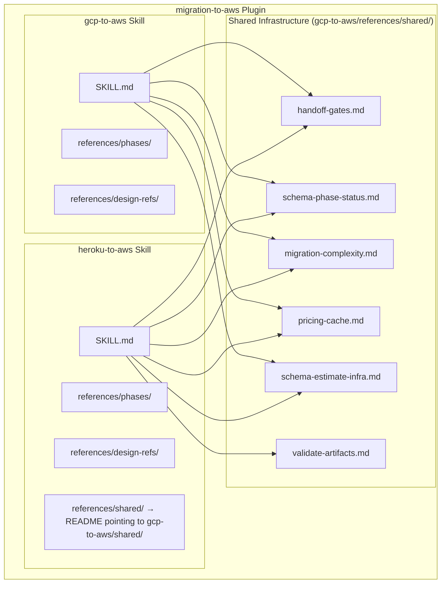
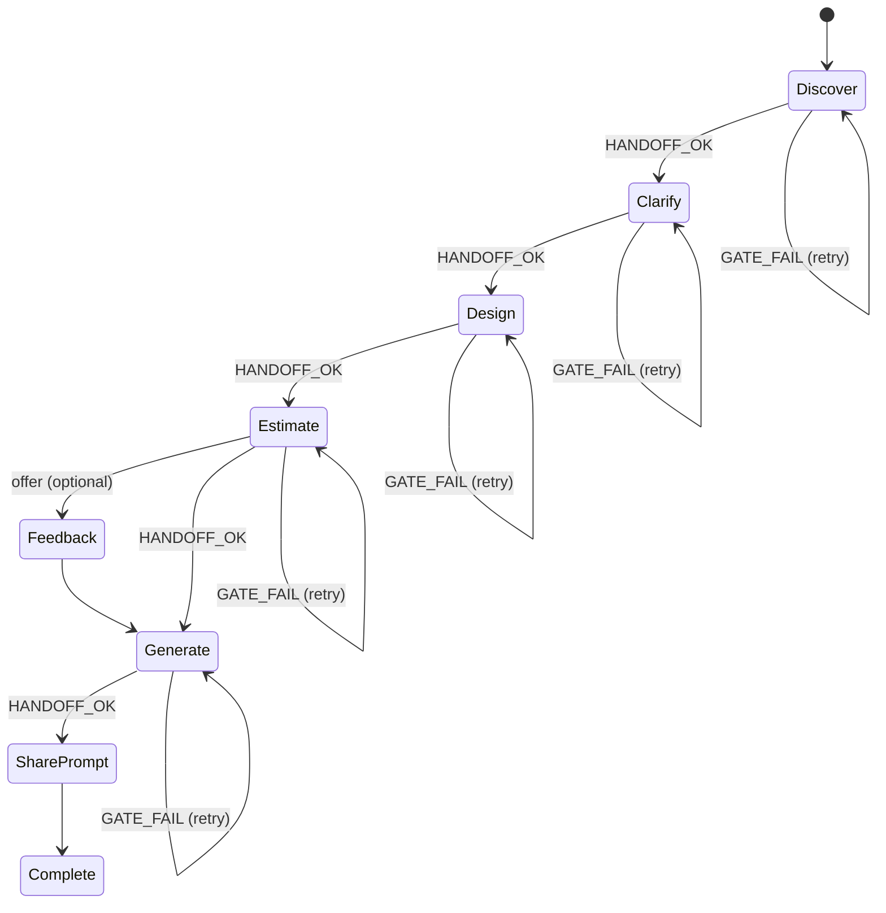
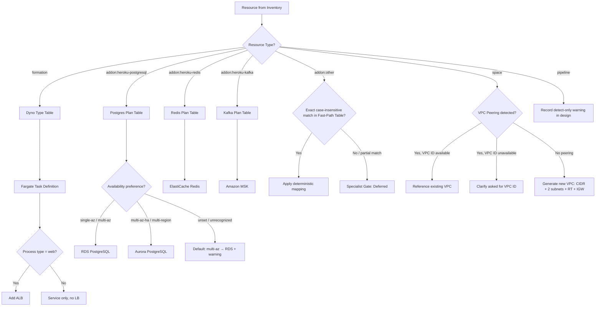

# Design Document: heroku-to-aws Migration Skill

## Overview

The `heroku-to-aws` skill is a new migration workflow module within the existing `migration-to-aws` plugin. It follows the same 6-phase architecture as the sibling `gcp-to-aws` skill (Discover → Clarify → Design → Estimate → Generate → Feedback) but is purpose-built for Heroku's simpler, flat resource model.

### Key Design Decisions

1. **Flat resource model**: Heroku resources are organized per-app without dependency graphs or clustering. This eliminates the topological sorting, typed edges, and cluster formation logic present in the gcp-to-aws skill.
2. **Terraform as primary discovery, billing as supplementary**: Terraform files containing `heroku_*` resources are the required primary discovery input. Heroku billing data (invoices, Enterprise CSV) supplements Terraform to provide cost context. Procfile and app.json further supplement discovery. No Heroku Platform API calls are made — the skill does not require or use a Heroku API token.
3. **Deterministic mappings for core services**: Dynos→Fargate, Postgres→RDS/Aurora, Redis→ElastiCache, Kafka→MSK use fixed lookup tables rather than rubric evaluation.
4. **Fast-path table for add-ons**: 13 common add-ons map deterministically to AWS services. Unknown add-ons hit the specialist gate — no automated mapping, only a deferral record.
5. **Shared infrastructure reuse**: Phase status, handoff gates, pricing MCP, complexity tiers, and feedback orchestrator are all reused from the plugin's shared references (physically located in the gcp-to-aws skill's `references/shared/` directory).
6. **Detect-only patterns**: Cedar/Fir generation and Pipeline/Review Apps are recorded in the inventory for informational purposes but do not drive Terraform generation or design logic in v1.
7. **Full platform exit as default**: Heroku is in sustaining engineering (KTLO) — no new investment, enterprise sales halted. This skill assumes full exit from Heroku (compute, data, add-ons) as the default outcome. Hybrid patterns are supported only as bounded interim cutover tactics with a required exit date.
8. **Fargate-only compute target**: No Elastic Beanstalk (legacy), no App Runner (KTLO as of April 2026). ECS Express Mode is documented as an optional simplified deployment path but does not alter the design mapping.

### Scope Boundaries (v1)

| In Scope                                                           | Out of Scope (v1)                                  |
| ------------------------------------------------------------------ | -------------------------------------------------- |
| Terraform-based discovery (`heroku_*` resources, primary)          | Platform API discovery (no token required or used) |
| Billing data discovery (invoices, Enterprise CSV, supplementary)   | AI workload detection or migration                 |
| Procfile/app.json as supplementary inputs                          | Billing-only design path                           |
| Core service mappings (Dynos, Postgres, Redis, Kafka)              | Fir-specific Terraform generation                  |
| Fast-path table for 13 common add-ons                              | CI/CD pipeline automation                          |
| Cedar/Fir detection (detect-only, from Terraform metadata)         | ARM/Graviton instance targeting                    |
| Pipeline/Review Apps (detect-only)                                 | CNB buildpack configuration                        |
| Private Space VPC peering support                                  | Elastic Beanstalk mapping                          |
| Optional billing comparison                                        | App Runner mapping                                 |
| Database migration method selection (pg_dump, DMS, Bucardo, WAL-G) | Indefinite hybrid "stay on Heroku"                 |
| Containerization prerequisites guidance                            | Automated CI/CD pipeline migration                 |
| ECS Express Mode documentation (informational only)                | Multi-region active-active                         |
| KTLO platform exit philosophy and urgency tiering                  | Heroku Platform API calls of any kind              |
| Config var → Secrets Manager/SSM migration guidance                |                                                    |

## Architecture

### High-Level Integration



### Skill Directory Structure

```
heroku-to-aws/
├── SKILL.md                              ← Orchestrator + state machine
├── references/
│   ├── phases/
│   │   ├── discover/
│   │   │   ├── discover.md               # Phase 1 orchestrator
│   │   │   ├── discover-terraform.md     # Terraform discovery (primary + required)
│   │   │   └── discover-billing.md       # Billing data parsing (optional)
│   │   ├── clarify/
│   │   │   └── clarify.md                # Phase 2: Adaptive questions (12–15, batched ≤5)
│   │   ├── design/
│   │   │   └── design.md                 # Phase 3: Single-pass flat resource mapping
│   │   ├── estimate/
│   │   │   └── estimate.md               # Phase 4: Cost projection
│   │   ├── generate/
│   │   │   ├── generate.md               # Phase 5: Artifact generation orchestrator
│   │   │   ├── generate-terraform.md     # Terraform configurations
│   │   │   └── generate-docs.md          # MIGRATION_GUIDE.md + README.md
│   │   └── feedback/
│   │       └── feedback.md               # Phase 6: Feedback collection (reuses shared)
│   ├── design-refs/
│   │   ├── fast-path-table.md            # Add-on → AWS deterministic mappings (13 entries)
│   │   ├── dyno-type-table.md            # Dyno type → Fargate CPU/memory
│   │   ├── postgres-plan-table.md        # Postgres plan → RDS/Aurora sizing
│   │   ├── redis-plan-table.md           # Redis plan → ElastiCache sizing
│   │   └── kafka-plan-table.md           # Kafka plan → MSK sizing
│   └── shared/
│       ├── README.md                     # Pointer: load from gcp-to-aws/references/shared/
│       ├── handoff-gates.md              # Local copy or symlink
│       ├── schema-phase-status.md        # Local copy or symlink
│       ├── migration-complexity.md       # Local copy or symlink
│       ├── pricing-cache.md              # Local copy or symlink
│       ├── schema-estimate-infra.md      # Local copy or symlink
│       ├── schema-discover-heroku.md     # Heroku-specific inventory schema
│       └── validate-artifacts.md         # Local copy or symlink
```

### Phase Flow and State Machine



Each phase follows: `pending` → `in_progress` → `completed`. Only one core phase may be `in_progress` at a time. The state machine reuses `references/shared/schema-phase-status.md` and `references/shared/handoff-gates.md` from the shared infrastructure.

**State determination (deterministic)**:

1. Read `$MIGRATION_DIR/.phase-status.json`
2. If `current_phase` exists, use it
3. Otherwise: evaluate ordered list `discover → clarify → design → estimate → generate`; pick first where status ≠ `completed`
4. If all completed → state is `complete`

**Mandatory Clarify gate**: Design, Estimate, and Generate refuse to load unless `phases.clarify == "completed"` in `.phase-status.json`.

## Components and Interfaces

### Discovery Engine

**Responsibility**: Inventory all Heroku resources from Terraform files (required primary source), supplemented by billing data, Procfile/app.json parsing. No Heroku Platform API calls are made.

**Inputs**:

- Workspace directory containing `.tf` files with `heroku_*` resources (REQUIRED — primary discovery path)
- Billing export files: Heroku Dashboard invoices or Enterprise CSV (supplementary — provides cost context)
- Procfile and/or app.json in workspace (supplementary — provides process types and app metadata)

**Outputs**:

- `heroku-resource-inventory.json` — flat array of all discovered resources
- `.phase-status.json` — updated to `discover: completed`

**Sub-components**:

1. **Terraform Discovery** (`discover-terraform.md`): Primary and required discovery path. Scans `.tf` files for `heroku_*` resource types. Extracts at minimum: `heroku_app`, `heroku_addon`, `heroku_formation`, `heroku_domain`, `heroku_config_association`, `heroku_pipeline`, `heroku_space`. Generation (Cedar/Fir) is inferred from Terraform metadata (e.g., `heroku_space` resource attributes) where possible.

2. **Procfile/app.json Parser** (within `discover.md`): Extracts process types, start commands, declared add-ons, environment variables, formation defaults, and buildpack config. Supplements Terraform data — cannot stand alone.

3. **Billing Parser** (`discover-billing.md`): Parses Heroku Dashboard invoices or Enterprise CSV exports into a billing profile (total monthly cost, line items per resource). Enables cost comparison in Estimate phase.

4. **Generation Detector** (within `discover.md`): Infers Cedar vs Fir generation from Terraform resource attributes and metadata. Sets `generation_action: "detect_only"` — no design or generation logic in v1. When generation cannot be determined, sets `heroku_generation: "unknown"` and appends `generation_unresolved` to diagnostics.

**Discovery failure modes**:

- No `.tf` files with `heroku_*` resources → STOP, request Terraform files
- Terraform parse errors on some files → set `confidence: "reduced"`, continue
- Procfile/app.json syntax errors → record warning, continue processing remaining resources
- Billing data unparseable → skip billing profile, continue with Terraform inventory

### Clarify Engine

**Responsibility**: Present 12–15 adaptive questions (batched ≤5 per batch) to gather migration preferences.

**Inputs**:

- `heroku-resource-inventory.json`
- User responses

**Outputs**:

- `preferences.json` — migration preferences conforming to plugin schema

**Question Categories** (12–15 questions, ≤5 per batch):

| Batch            | Questions | Topics                                                                                                                |
| ---------------- | --------- | --------------------------------------------------------------------------------------------------------------------- |
| 1 (Global)       | Q1–Q5     | Target AWS region, compliance requirements, availability posture, migration approach, environment naming              |
| 2 (Data/Network) | Q6–Q10    | Database HA preference, database migration method, Redis HA, VPC subnet IDs (if Private Space detected), DNS strategy |
| 3 (Operational)  | Q11–Q15   | Containerization status, Fir intent (if Fir detected), maintenance window, log retention period, cost optimization    |

**Fast-path mode** (< 5 apps AND no Private Spaces AND no Kafka): Reduces to 3–5 questions from Batch 1, applying defaults for all skipped questions. Each defaulted answer records `source: "default"`.

**Fast-path default values** (applied when questions are skipped):

- `migration_approach`: `full_cutover`
- `migration_method`: `pg_dump_restore`
- `containerization_status`: `buildpack_only`
- `database_ha`: `multi-az`
- `redis_ha`: `true`
- `dns_strategy`: `route53`
- `log_retention_days`: `30`
- `cost_optimization`: `balanced`
- `container_registry`: `ecr`

These defaults assume a straightforward small-stack migration. Users in fast-path mode are explicitly informed: "Defaults applied: pg_dump for database migration, full cutover (no interim phase), routine urgency. Use 'I want to change something' to override."

**Validation rules**:

- Invalid option → reject input, indicate valid options, re-prompt same question
- "Use defaults for the rest" → apply defaults for all remaining, record `source: "default"` per answer
- Subnet IDs → must match `subnet-xxxxxxxxxxxxxxxxx` format, accept 1–6 comma-separated values
- VPC ID → must match `vpc-xxxxxxxxxxxxxxxxx` format (prompted only when peering detected but VPC ID unavailable)
- `target_exit_date` → must be valid ISO 8601 date, required when `interim_cutover_data_first` is selected

**Migration approach question**: Options: `full_cutover` (default — migrate database and application together) or `interim_cutover_data_first` (database first, app stays on Heroku temporarily). Fires for ALL stacks with Postgres. When interim is selected, require `target_exit_date` (ISO 8601) and emit KTLO warning. Persisted in `preferences.json` under `global.migration_approach`.

**Database migration method question**: Options: `pg_dump_restore` (simplest, downtime required — recommended for <10GB), `dms` (DMS, shorter downtime for large DBs — note: cannot do continuous replication with Heroku Postgres), `bucardo` (trigger-based replication, near-zero downtime), `wal_g` (WAL-based, minimal downtime for large DBs). Persisted in `preferences.json` under `data.migration_method`.

**Containerization status question**: Options: `containerized` (Dockerfile exists), `buildpack_only` (Heroku buildpacks, no Dockerfile), `partial` (mixed). Gates documentation section in MIGRATION_GUIDE.md — does not alter design mapping.

**Fir intent question** (conditional): Present ONLY when at least one app has `heroku_generation == "fir"`. Options: exit Heroku abstraction entirely, move to self-managed EKS/ECS, or interim cutover (data-first, bounded). When `interim_cutover_data_first` is selected, require `target_exit_date` and emit KTLO platform risk warning. Persisted in `preferences.json` under `global.fir_intent`.

**Interim cutover handling**: When any user selects a data-first approach with app remaining on Heroku temporarily, `preferences.json` SHALL include `global.interim_cutover: true`, `global.target_exit_date: "<ISO date>"`, and `global.ktlo_warning: "Heroku is in sustaining engineering. Hybrid operation should be bounded to weeks, not quarters."`

### Design Engine

**Responsibility**: Map each Heroku resource to AWS services using deterministic lookup tables. Single-pass, flat-list processing — no multi-pass, no cluster-based design.

**Inputs**:

- `heroku-resource-inventory.json`
- `preferences.json`

**Outputs**:

- `aws-design.json` — designed AWS architecture with per-resource mappings

**Mapping Strategy** (single-pass, input-order processing):



**Core mapping rules per resource type**:

| Resource Type             | Lookup Table             | AWS Target                          | Confidence      |
| ------------------------- | ------------------------ | ----------------------------------- | --------------- |
| `formation`               | `dyno-type-table.md`     | Fargate (+ ALB for `web`)           | `deterministic` |
| `addon:heroku-postgresql` | `postgres-plan-table.md` | RDS PostgreSQL or Aurora PostgreSQL | `deterministic` |
| `addon:heroku-redis`      | `redis-plan-table.md`    | ElastiCache Redis                   | `deterministic` |
| `addon:heroku-kafka`      | `kafka-plan-table.md`    | Amazon MSK                          | `deterministic` |
| `addon:{matched}`         | `fast-path-table.md`     | Varies (see table)                  | `deterministic` |
| `addon:{unmatched}`       | Specialist gate          | None (deferred)                     | n/a             |
| `space`                   | VPC logic                | VPC (existing or new)               | `deterministic` |
| `pipeline`                | Detect-only              | None                                | n/a (warning)   |

**Fir-generation handling in Design**: The Design Engine SHALL NOT produce ARM/Graviton instance targeting or CNB buildpack configuration for any workload regardless of `heroku_generation`. Fir workloads receive a notation in the design output identifying them as deferred to a future version, and noting that Fir workloads may already run on AWS infrastructure (potentially reducing compute migration lift) while still requiring exit from the Heroku control plane.

### Estimate Engine

**Responsibility**: Calculate projected monthly AWS costs using pricing MCP server (secondary) and pricing cache (primary).

**Inputs**:

- `aws-design.json`
- `preferences.json`
- Optional: `billing_profile` section from `heroku-resource-inventory.json`

**Outputs**:

- `estimation-infra.json` — conforming to `schema-estimate-infra.md`

**Pricing resolution order**:

1. Check `references/shared/pricing-cache.md` (cached rates, ±5–10%)
2. If not found in cache → query awspricing MCP server (`get_pricing` tool)
3. If MCP unavailable after 3 attempts (10s timeout each) → use cache only, mark `pricing_source: "cached_fallback"`
4. If pricing unavailable from both → mark resource `"unpriced"`, exclude from total, add to warnings

**Heroku comparison**: When billing profile is available from discovery, include a side-by-side comparison: current Heroku monthly spend vs projected AWS monthly spend, broken down per app.

### Generate Engine

**Responsibility**: Produce Terraform configurations, migration scripts, and documentation.

**Inputs**:

- `aws-design.json`
- `estimation-infra.json`
- `preferences.json`
- `heroku-resource-inventory.json`

**Outputs**:

- `terraform/` — Terraform configurations for all designed AWS resources (must pass `terraform validate`)
- `MIGRATION_GUIDE.md` — ordered migration steps (prerequisites, data migration per data store, verification)
- `README.md` — artifact listing, file purposes, apply command sequence
- Database migration scripts (`pg_dump`/`pg_restore` wrappers with connection parameter placeholders)
- `generation-warnings.json` — any resources that couldn't be generated

**VPC generation rules**:

- Private Space with peering → reference existing VPC ID + subnet IDs as variables/data sources
- No Private Space → generate new VPC (CIDR, ≥2 subnets in separate AZs, route table, internet gateway)
- Security groups restrict inbound to declared dependency CIDRs/ports only; deny all other inbound by default

**MIGRATION_GUIDE.md structure**:

1. Prerequisites section (including containerization prerequisites when `buildpack_only` or `partial`)
2. Containerization guidance — when applicable: Procfile→Dockerfile patterns for Ruby, Node.js, Python, Go, Java
3. Data migration procedure — method-specific section based on `data.migration_method` preference:
   - `pg_dump_restore`: Full Heroku CLI cutover runbook (maintenance:on, pg:backups:capture, pg:backups:download, pg_restore, verify, addons:detach, config:set DATABASE_URL, maintenance:off)
   - `dms`: DMS replication instance setup, endpoint configuration, migration task with "Migrate existing data" + "Full LOB mode", pre-migration assessment, then Heroku CLI cutover sequence; includes CDC limitation warning
   - `bucardo`: Setup requirements reference, EC2 infrastructure notes, Heroku CLI cutover sequence
   - `wal_g`: Setup requirements reference, EC2 infrastructure notes, Heroku CLI cutover sequence
4. Interim Database Exposure section (when `interim_cutover_data_first`) — public RDS configuration, RDS CA cert + sslmode=verify-full, rds.force_ssl parameter, security group rules, reminder to disable public access after app migration
5. Redis migration procedure (when Redis in design)
6. Kafka migration procedure (when Kafka in design)
7. Config var migration — export Heroku config vars (`heroku config --json`), import to AWS Secrets Manager or SSM Parameter Store, reference in ECS task definition `secrets` block
8. Deferred add-ons — listed as manual migration items with specialist consultation note
9. Post-Migration Lockdown section — disable public accessibility on RDS/Aurora, verify backup configuration, confirm security group restrictions
10. Platform Risk callout (when interim cutover selected) — KTLO warning, bounded timeline guidance
11. ECS Express Mode note — paragraph noting simplified deployment option, same underlying Fargate + ALB cost model
12. Verification section — how to confirm each step succeeded

**Omission rules**: If a designed AWS resource has no supported Terraform resource mapping → skip it, log to `generation-warnings.json`, continue generating remaining resources.

### Feedback Engine

**Responsibility**: Collect user feedback and encode shareable migration plan.

Reuses the existing feedback phase orchestrator from the plugin shared infrastructure. Feedback is offered once after Estimate completes. Plan sharing is offered both after Estimate and after Generate.

## Data Models

### heroku-resource-inventory.json (Phase 1 Output)

Complete schema defined in `references/shared/schema-discover-heroku.md`. Key structural elements:

```json
{
  "metadata": {
    "discovery_timestamp": "ISO 8601",
    "total_apps_discovered": 4,
    "discovery_sources": ["terraform", "procfile"],
    "confidence": "full|reduced",
    "confidence_note": "optional explanation when reduced"
  },
  "apps": [
    {
      "app_name": "my-web-app",
      "app_id": "UUID",
      "heroku_generation": "cedar|fir|unknown",
      "generation_action": "detect_only",
      "generation_diagnostics": [],
      "space": null,
      "discovery_status": "success|discovery_failed",
      "failure_reason": null,
      "procfile_parse_warning": null,
      "app_json_parse_warning": null
    }
  ],
  "resources": [
    {
      "resource_id": "formation:my-web-app:web",
      "resource_type": "formation|addon|space|pipeline",
      "heroku_app": "my-web-app|unassociated",
      "config": {/* type-specific */}
    }
  ],
  "billing_profile": {/* optional */},
  "terraform_metadata": {/* optional */}
}
```

**Resource ID formats**:

| Type        | Format                           | Example                                         |
| ----------- | -------------------------------- | ----------------------------------------------- |
| `formation` | `formation:{app}:{process_type}` | `formation:my-web-app:web`                      |
| `addon`     | `addon:{app}:{service}:{plan}`   | `addon:my-web-app:heroku-postgresql:standard-0` |
| `space`     | `space:{name}`                   | `space:my-private-space`                        |
| `pipeline`  | `pipeline:{name}`                | `pipeline:my-pipeline`                          |

**Per-type config schemas**:

- **formation**: `process_type`, `command`, `dyno_type`, `quantity` (0–100)
- **addon (heroku-postgresql)**: `addon_service`, `plan`, `provider`, `connection_pooling`
- **addon (heroku-redis)**: `addon_service`, `plan`, `provider`, `ha_enabled`, `encryption_in_transit`, `redis_version`
- **addon (heroku-kafka)**: `addon_service`, `plan`, `provider`, `topic_count`, `partitions_per_topic`, `replication_factor`
- **addon (other)**: `addon_service`, `plan`, `provider`
- **space**: `space_name`, `region`, `shield`, `peering` (detected, vpc_id, peer_cidr)
- **pipeline**: `pipeline_name`, `stages[]`, `review_apps_enabled`, `detection_status`

**Forbidden fields** (from GCP clustering model — MUST NOT appear):
`cluster_id`, `creation_order_depth`, `edges`, `dependencies`, `must_migrate_together`

### preferences.json (Phase 2 Output)

```json
{
  "migration_id": "0315-1030",
  "skill": "heroku-to-aws",
  "global": {
    "target_region": "us-east-1",
    "compliance": "none|hipaa|soc2|pci",
    "availability": "single-az|multi-az|multi-az-ha|multi-region",
    "migration_approach": "full_cutover|interim_cutover_data_first",
    "maintenance_window": { "day": "sunday", "hour_utc": 4 },
    "environment_naming": "production",
    "fir_intent": "exit_heroku|self_managed_eks_ecs|null",
    "interim_cutover": false,
    "target_exit_date": "2026-09-01|null",
    "ktlo_warning": "Heroku is in sustaining engineering. Hybrid operation should be bounded to weeks, not quarters.|null"
  },
  "data": {
    "database_ha": "single-az|multi-az|multi-az-ha|multi-region",
    "migration_method": "pg_dump_restore|dms|bucardo|wal_g",
    "redis_ha": true,
    "kafka_retention_days": 7,
    "dns_strategy": "route53|external"
  },
  "network": {
    "existing_vpc_id": "vpc-xxx|null",
    "subnet_ids": ["subnet-aaa", "subnet-bbb"],
    "private_space_detected": true
  },
  "operational": {
    "containerization_status": "containerized|buildpack_only|partial",
    "container_registry": "ecr",
    "log_retention_days": 30,
    "alerting": "cloudwatch|pagerduty|opsgenie",
    "cost_optimization": "balanced|aggressive|conservative"
  },
  "defaults_applied": ["Q12", "Q13"],
  "sources": {
    "Q1": "user",
    "Q2": "user",
    "Q12": "default",
    "Q13": "default"
  }
}
```

### aws-design.json (Phase 3 Output)

```json
{
  "phase": "design",
  "design_source": "heroku_terraform",
  "timestamp": "ISO 8601",
  "metadata": {
    "total_services": 8,
    "total_apps_migrated": 2,
    "fir_workloads_detected": [],
    "fir_generation_note": "Fir-specific generation deferred to future version"
  },
  "services": [
    {
      "service_id": "fargate:my-web-app:web",
      "source_resource_id": "formation:my-web-app:web",
      "heroku_app": "my-web-app",
      "aws_service": "Fargate",
      "confidence": "deterministic",
      "aws_config": {
        "region": "us-east-1",
        "task_cpu": 512,
        "task_memory": 1024,
        "desired_count": 2,
        "container_image": "placeholder:my-web-app-web",
        "process_type": "web",
        "load_balancer": true
      }
    }
  ],
  "deferred": [
    {
      "addon_name": "custom-addon",
      "addon_plan": "enterprise",
      "provider": "third-party-co",
      "reason": "Not found in Fast_Path_Table",
      "recommendation": "Engage AWS account team for replacement selection"
    }
  ],
  "warnings": [
    "Pipeline 'my-pipeline' detected — CI/CD mapping requires manual configuration"
  ],
  "vpc_design": {
    "mode": "existing_vpc|new_vpc",
    "existing_vpc_id": "vpc-xxx|null",
    "subnet_ids": ["subnet-aaa", "subnet-bbb"],
    "security_groups": [
      {
        "name": "heroku-migrated-app-sg",
        "inbound_rules": [
          { "port": 443, "protocol": "tcp", "cidr": "0.0.0.0/0" },
          { "port": 5432, "protocol": "tcp", "cidr": "10.0.0.0/16" }
        ],
        "outbound_rules": [
          { "port": 0, "protocol": "-1", "cidr": "0.0.0.0/0" }
        ]
      }
    ]
  }
}
```

### Lookup Tables (Design-Refs)

#### Dyno Type Table (`design-refs/dyno-type-table.md`)

| Heroku Dyno Type | CPU (shares) | Memory (MB) | Fargate CPU (units) | Fargate Memory (MiB) |
| ---------------- | ------------ | ----------- | ------------------- | -------------------- |
| standard-1x      | 1x           | 512         | 256                 | 512                  |
| standard-2x      | 2x           | 1024        | 512                 | 1024                 |
| performance-m    | 6x           | 2560        | 1024                | 2048                 |
| performance-l    | 12x          | 14336       | 4096                | 16384                |
| private-s        | 1x           | 1024        | 512                 | 1024                 |
| private-m        | 6x           | 2560        | 1024                | 2048                 |
| private-l        | 12x          | 14336       | 4096                | 16384                |

All rows use valid Fargate CPU/memory pairings. Matching is exact, case-insensitive. Unknown types produce a mapping rejection error.

#### Postgres Plan Table (`design-refs/postgres-plan-table.md`)

Maps 30+ plan tiers (hobby, standard, premium, private, shield) to RDS/Aurora instance classes. Service selection is driven by user availability preference:

| Availability Preference | AWS Target                                     |
| ----------------------- | ---------------------------------------------- |
| `single-az`             | RDS PostgreSQL                                 |
| `multi-az`              | RDS PostgreSQL (Multi-AZ)                      |
| `multi-az-ha`           | Aurora PostgreSQL                              |
| `multi-region`          | Aurora PostgreSQL                              |
| unset/unrecognized      | Default: `multi-az` → RDS PostgreSQL + warning |

Additional logic: if source plan has connection pooling → include RDS Proxy.

#### Redis Plan Table (`design-refs/redis-plan-table.md`)

Maps 27 plan tiers (hobby, premium-0 through premium-14, private-1 through private-7) to ElastiCache node types based on memory. HA plans get Multi-AZ + automatic failover. Encryption-in-transit mirrors source. Redis engine version matches source major version.

#### Kafka Plan Table (`design-refs/kafka-plan-table.md`)

Maps 10 plan tiers (basic, standard, extended, private-extended) to MSK broker instance types and storage. All clusters get minimum 2 brokers across 2 AZs. Standard/extended plans get 3 brokers across 3 AZs. Preserves topic count, partition count, and replication factor.

#### Fast-Path Table (`design-refs/fast-path-table.md`)

| Heroku Add-On        | AWS Service(s)        | Mapping Type |
| -------------------- | --------------------- | ------------ |
| Papertrail           | CloudWatch Logs       | Single       |
| SendGrid             | Amazon SES            | Single       |
| Heroku Scheduler     | EventBridge Scheduler | Single       |
| Memcachier           | ElastiCache Memcached | Single       |
| Bucketeer            | S3                    | Single       |
| CloudAMQP            | Amazon MQ             | Single       |
| Bonsai Elasticsearch | Amazon OpenSearch     | Single       |
| Scout APM            | CloudWatch + X-Ray    | Composite    |
| Rollbar              | CloudWatch            | Single       |
| New Relic            | CloudWatch + X-Ray    | Composite    |
| Twilio               | Amazon SNS (SMS)      | Single       |
| Cloudinary           | S3 + CloudFront       | Composite    |
| Sentry               | CloudWatch            | Single       |

Matching: exact case-insensitive string comparison. Partial matches are NOT valid — treated as unmatched → specialist gate.

### Phase Status (Shared Schema)

```json
{
  "migration_id": "0315-1030",
  "last_updated": "2026-03-15T10:30:00Z",
  "current_phase": "discover",
  "phases": {
    "discover": "in_progress",
    "clarify": "pending",
    "design": "pending",
    "estimate": "pending",
    "generate": "pending",
    "feedback": "pending"
  }
}
```

Status progression: `pending` → `in_progress` → `completed`. Never backward. Update protocol: read-merge-write (read current file, change only advancing phases + `last_updated`, write full file).

### Integration with Shared Infrastructure

| Shared Resource            | Location                        | Usage in heroku-to-aws                                           |
| -------------------------- | ------------------------------- | ---------------------------------------------------------------- |
| `handoff-gates.md`         | `gcp-to-aws/references/shared/` | Phase completion validation (HANDOFF_OK / GATE_FAIL)             |
| `schema-phase-status.md`   | `gcp-to-aws/references/shared/` | State machine schema and transition rules                        |
| `migration-complexity.md`  | `gcp-to-aws/references/shared/` | Complexity tier classification (Small/Medium/Large) for timeline |
| `pricing-cache.md`         | `gcp-to-aws/references/shared/` | Primary pricing source for Estimate phase                        |
| `schema-estimate-infra.md` | `gcp-to-aws/references/shared/` | Output schema for `estimation-infra.json`                        |
| `validate-artifacts.md`    | `gcp-to-aws/references/shared/` | Pre-report validation in Generate phase                          |
| awspricing MCP server      | Plugin-level                    | Secondary pricing source (same endpoints as gcp-to-aws)          |
| Feedback orchestrator      | Plugin-level                    | Feedback collection and plan encoding                            |

## Correctness Properties

_A property is a characteristic or behavior that should hold true across all valid executions of a system—essentially, a formal statement about what the system should do. Properties serve as the bridge between human-readable specifications and machine-verifiable correctness guarantees._

### Property 1: Phase transition validity

_For any_ phase transition attempt, the state machine SHALL allow a phase to move to `in_progress` only when its predecessor phase status is `completed`. On GATE_FAIL, the pipeline SHALL halt with the failing phase retaining `in_progress` status. On unrecoverable error, the failing phase SHALL revert to `pending` while all prior completed phases remain `completed` unchanged.

**Validates: Requirements 1.3, 1.7, 1.8, 17.2**

### Property 2: Procfile parsing round-trip

_For any_ valid Procfile containing one or more process type declarations (web, worker, release, clock, or custom types), parsing SHALL extract every declared process type name and its associated start command such that the set of extracted (type, command) pairs is identical to the set of declarations in the source Procfile.

**Validates: Requirements 2.3**

### Property 3: app.json extraction completeness

_For any_ valid app.json manifest containing any combination of add-ons, environment variables, formation defaults, and buildpack configuration sections, the extractor SHALL produce an output that includes every declared section with correct field values preserved.

**Validates: Requirements 2.4**

### Property 4: Inventory schema conformance

_For any_ set of discovered resources (from Terraform, Procfile, or billing), the produced `heroku-resource-inventory.json` SHALL: contain a `metadata` section with `discovery_timestamp`, `total_apps_discovered`, `discovery_sources`, and `confidence`; contain an `apps[]` array where every entry has `app_name`, `heroku_generation`, `generation_action`, and `discovery_status`; and contain a `resources[]` array where every entry has `resource_id`, `resource_type`, `heroku_app`, and `config`.

**Validates: Requirements 2.6, 16.1, 16.4**

### Property 5: Terraform resource extraction

_For any_ `.tf` file containing `heroku_*` resource blocks from the supported set (heroku_app, heroku_addon, heroku_formation, heroku_domain, heroku_config_association, heroku_pipeline, heroku_space), the Discovery Engine SHALL extract every resource's type, name, and key configuration attributes into the inventory.

**Validates: Requirements 3.1, 3.4**

### Property 6: Fargate mapping preserves dyno specifications

_For any_ valid formation entry with a recognized dyno type, the Design Engine SHALL produce exactly one Fargate task definition where: CPU and memory match the Dyno Type Table lookup for that dyno type, `desired_count` equals the source formation quantity (0–100 inclusive), and an Application Load Balancer is included in the design if and only if the process type is `web`.

**Validates: Requirements 4.1, 4.2, 4.4, 4.5, 4.6**

### Property 7: Postgres mapping selects correct service and sizing

_For any_ Heroku Postgres add-on with a recognized plan tier, the Design Engine SHALL: select RDS PostgreSQL when availability preference is `single-az` or `multi-az`; select Aurora PostgreSQL when availability preference is `multi-az-ha` or `multi-region`; default to `multi-az` with RDS PostgreSQL and emit a warning when availability preference is unset or unrecognized; map to an instance class whose RAM and vCPU meet or exceed the source plan tier's capacity per the Postgres Plan Table; configure storage to meet or exceed the source plan's maximum; and include RDS Proxy if and only if connection pooling is enabled on the source plan.

**Validates: Requirements 5.1, 5.2, 5.3, 5.4, 5.5, 5.6, 5.7**

### Property 8: Redis mapping preserves configuration

_For any_ Heroku Redis add-on with a recognized plan tier, the Design Engine SHALL: select an ElastiCache node type whose available memory meets or exceeds the source plan's memory limit; configure Multi-AZ with automatic failover if and only if the source plan has HA enabled; select a Redis engine version compatible with the source Redis version (same major version); and enable in-transit encryption if and only if the source plan has encryption-in-transit enabled.

**Validates: Requirements 6.2, 6.3, 6.4, 6.5**

### Property 9: Kafka mapping preserves topology and meets sizing

_For any_ Heroku Kafka add-on with a recognized plan tier, the Design Engine SHALL: map to an MSK broker instance type whose throughput meets or exceeds the source plan's throughput; map storage per broker such that total cluster storage meets or exceeds source capacity; preserve topic count, partition count per topic, and replication factor from the source plan; and specify a minimum of 2 brokers spread across at least 2 availability zones.

**Validates: Requirements 7.2, 7.3, 7.4**

### Property 10: Fast-path table matching and deferral

_For any_ discovered add-on, the Design Engine SHALL: apply the Fast-Path Table mapping with confidence `"deterministic"` if and only if the add-on name is an exact case-insensitive match to a table entry (partial substring matches are treated as unmatched); include all listed AWS services for composite mapping entries as a single group with one `"deterministic"` confidence; and for any add-on whose name does not exactly match any entry (including partial matches), mark it as `"Deferred — specialist engagement"` with no automated AWS mapping produced.

**Validates: Requirements 8.2, 8.3, 8.5, 18.1, 18.4**

### Property 11: Specialist gate records all required fields

_For any_ add-on deferred via the specialist gate, the design artifact SHALL include: add-on name, add-on plan, provider, reason for deferral, and a recommendation to engage the AWS account team for replacement selection.

**Validates: Requirements 18.2**

### Property 12: Flat resource model invariant

_For any_ discovery or design output, resources SHALL be organized as a flat array without `cluster_id`, `creation_order_depth`, `edges`, `dependencies`, or `must_migrate_together` fields. Resources SHALL be processed in input order with exactly one deterministic mapping per resource type. All resources belonging to the same Heroku app SHALL share an identical `heroku_app` value, and resources that cannot be associated with exactly one app SHALL use `heroku_app: "unassociated"`.

**Validates: Requirements 16.1, 16.2, 16.3, 16.4, 16.5**

### Property 13: VPC design matches peering state

_For any_ design where Private Space VPC peering is detected with an available VPC ID, the generated Terraform SHALL reference the existing VPC ID and provided subnet IDs rather than creating new network resources. For any design without Private Space peering, the VPC design SHALL include a CIDR block, at least 2 subnets across separate availability zones, a route table, and an internet gateway. When generating security groups for Private Space migration, inbound rules SHALL restrict traffic to only the CIDR ranges and ports used by the application's declared dependencies, denying all other inbound by default.

**Validates: Requirements 9.1, 9.4, 9.5**

### Property 14: No Fir-specific Terraform generation

_For any_ inventory containing Fir-generation workloads, the Design Engine SHALL NOT produce ARM/Graviton instance targeting or CNB buildpack configuration in any output artifact, and SHALL include a notation in the design output identifying which workloads are Fir-generation and noting that Fir-specific generation is deferred to a future version.

**Validates: Requirements 10.4, 10.5**

### Property 15: Clarify question count and batching

_For any_ inventory, the Clarify Engine SHALL present between 12 and 15 questions organized into batches of no more than 5 questions each. When the inventory meets fast-path criteria (fewer than 5 apps AND no Private Spaces AND no Kafka), the question count SHALL be reduced to between 3 and 5 with defaults applied for all skipped questions. The Fir intent question SHALL be included if and only if at least one app in the inventory has `heroku_generation == "fir"`.

**Validates: Requirements 11.1, 11.2, 11.6**

### Property 16: Estimate cost consistency

_For any_ design with N resources, the Estimate Engine SHALL calculate a projected monthly cost for each designed resource individually, and the total projected monthly cost SHALL equal the sum of all individual resource costs. For any resource where pricing is unavailable from both the MCP server and the pricing cache, that resource SHALL be marked `"unpriced"`, excluded from the total sum, and listed in a warnings array.

**Validates: Requirements 14.1, 14.5**

### Property 17: Migration guide content matches design

_For any_ generated MIGRATION_GUIDE.md, it SHALL include a data migration procedure section for each data store type (Postgres, Redis, Kafka) present in the designed architecture and SHALL omit procedure sections for data store types not present in the design. For any deferred add-ons in the design, the guide SHALL include them as manual migration items listing add-on name, plan, and specialist consultation note.

**Validates: Requirements 15.2, 15.7, 18.3**

### Property 18: Unrecognized plan/type produces error

_For any_ dyno type not present in the Dyno Type Table, or Postgres plan tier not in the Postgres Plan Table, or Redis plan tier not in the Redis Plan Table, or Kafka plan tier not in the Kafka Plan Table, the Design Engine SHALL reject the mapping for that resource and produce an error message identifying the unrecognized type/plan name.

**Validates: Requirements 4.3, 5.8, 6.6, 7.5**

### Property 19: Complexity tier classification

_For any_ set of complexity inputs (service count, monthly spend, has databases, has stateful storage, availability, compliance, multi-region), the tier classification SHALL evaluate from Large down to Small, assigning the first tier whose condition is met. A classification of Large requires ANY Large condition to be true; Medium requires NOT Large AND ANY Medium condition true; Small requires NOT Large AND NOT Medium.

**Validates: Requirements 17.5**

### Property 20: Interim cutover requires target exit date and KTLO warning

_For any_ preferences where `migration_approach` is set to `interim_cutover_data_first`, the preferences.json artifact SHALL contain a `target_exit_date` field with a valid ISO 8601 date value, an `interim_cutover` field set to `true`, and a `ktlo_warning` field containing the platform risk statement. The generated MIGRATION_GUIDE.md SHALL include a "Platform Risk" callout section and an "Interim Database Exposure" section documenting public RDS access with TLS requirements.

**Validates: Requirements 19.3, 19.5, 19.6, 20.8**

### Property 21: Migration guide sections match migration method and containerization status

_For any_ generated MIGRATION_GUIDE.md, the data migration procedure section SHALL correspond to the selected `migration_method` from preferences: `pg_dump_restore` produces Heroku CLI cutover runbook commands, `dms` produces DMS setup with CDC limitation warning, `bucardo` or `wal_g` produce EC2 infrastructure requirements. When `containerization_status` is `buildpack_only` or `partial`, the guide SHALL include a "Containerization Prerequisites" section. When `containerization_status` is `containerized`, the guide SHALL omit the containerization section.

**Validates: Requirements 20.3, 20.4, 20.5, 20.6, 21.1, 21.2**

### Property 22: No Elastic Beanstalk or App Runner in design output

_For any_ generated `aws-design.json` artifact, the `services` array SHALL NOT contain any entry where `aws_service` equals "Elastic Beanstalk", "App Runner", or "ECS Express Mode". All compute workloads SHALL be mapped to standard Fargate task definitions regardless of containerization status or any other preference.

**Validates: Requirements 19.2, 19.7, 21.4**

## Error Handling

### Phase-Level Error Handling

| Error Category                                 | Behavior                                                                 | Status Transition      |
| ---------------------------------------------- | ------------------------------------------------------------------------ | ---------------------- |
| No `.tf` files with `heroku_*` resources       | Stop, request Terraform files                                            | Remain `pending`       |
| Terraform parse errors on some files           | Set confidence "reduced", continue                                       | Continue `in_progress` |
| Procfile/app.json syntax error                 | Record warning per app, continue processing                              | Continue `in_progress` |
| Unrecognized dyno type                         | Reject mapping for that formation, report error                          | Continue `in_progress` |
| Unrecognized Postgres/Redis/Kafka plan         | Halt mapping for that add-on, report error                               | Continue `in_progress` |
| Pricing MCP unavailable (3 attempts, 10s each) | Fall back to pricing cache, mark `pricing_source: "cached_fallback"`     | Continue `in_progress` |
| Pricing unavailable from MCP + cache           | Mark resource `"unpriced"`, exclude from total, add to warnings          | Continue `in_progress` |
| AWS resource has no Terraform mapping          | Skip resource, log to `generation-warnings.json`                         | Continue `in_progress` |
| Phase gate failure (GATE_FAIL)                 | Halt pipeline, retain `in_progress`, surface diagnostic                  | Remain `in_progress`   |
| Unrecoverable phase error                      | Revert to `pending`, preserve prior completed phases, surface diagnostic | Revert to `pending`    |
| Billing data unparseable                       | Log warning, skip billing profile, continue                              | Continue `in_progress` |
| Pipeline/Review Apps detection failure         | Record failure reason in inventory, continue                             | Continue `in_progress` |
| Generation detection timeout (30s)             | Set `heroku_generation: "unknown"`, append `generation_unresolved`       | Continue `in_progress` |

### User-Facing Error Messages

- **No Terraform**: "No Terraform files with heroku_* resources found. Heroku Terraform is required for discovery. Procfile and app.json alone are not sufficient."
- **Dyno type unknown**: "Unsupported dyno type: `{type}`. Cannot map to Fargate. Please contact support or provide manual sizing."
- **Plan unrecognized**: "Unrecognized {service} plan tier: `{plan}`. Cannot determine AWS sizing. Deferring to specialist engagement."
- **Gate failure**: "GATE_FAIL | phase={phase} | field={field} | reason={reason}. Re-run Phase {N} ({name}) to produce the missing field, then continue."
- **Subnet format invalid**: "Invalid subnet ID format. Expected: subnet-xxxxxxxxxxxxxxxxx (subnet- followed by 17 hexadecimal characters). Provide 1–6 valid subnet IDs."
- **Phase ordering**: "Cannot enter Phase X: Phase Y-1 not completed. Start from Phase Y or resume Phase Y-1."

### Retry and Timeout Strategy

| Operation              | Retries    | Timeout         | Backoff                           |
| ---------------------- | ---------- | --------------- | --------------------------------- |
| Pricing MCP server     | 3 attempts | 10s per attempt | None (sequential)                 |
| Generation detection   | 1 attempt  | 30s             | N/A (set to "unknown" on timeout) |
| Terraform file parsing | No retries | N/A             | Mark file with warning            |

## Testing Strategy

### Property-Based Testing

**Library**: fast-check (TypeScript) — chosen for compatibility with the existing plugin test infrastructure.

**Configuration**: Minimum 100 iterations per property test.

**Tag format**: `Feature: heroku-to-aws-migration, Property {N}: {property_text}`

Each correctness property (1–19) will be implemented as a single property-based test with appropriate generators:

| Property                           | Key Generators Needed                                                                                               |
| ---------------------------------- | ------------------------------------------------------------------------------------------------------------------- |
| 1 (Phase transitions)              | Random phase names, random predecessor status values                                                                |
| 2 (Procfile parsing)               | Random process type names + command strings                                                                         |
| 3 (app.json extraction)            | Random app.json structures with varying section combinations                                                        |
| 4 (Inventory schema)               | Random resource sets from all types                                                                                 |
| 5 (Terraform extraction)           | Random `.tf` content with heroku_* resource blocks                                                                  |
| 6 (Fargate mapping)                | Random formations with dyno types drawn from table rows                                                             |
| 7 (Postgres mapping)               | Random plan tiers × random availability preferences                                                                 |
| 8 (Redis mapping)                  | Random plan tiers with HA/encryption/version flags                                                                  |
| 9 (Kafka mapping)                  | Random plan tiers with topic/partition/replication values                                                           |
| 10 (Fast-path matching)            | Random add-on names: case variations of table entries, partial substrings, and unknowns                             |
| 11 (Specialist gate records)       | Random deferred add-on configurations                                                                               |
| 12 (Flat model invariant)          | Random inventories of varying size and composition                                                                  |
| 13 (VPC design)                    | Random peering states × random dependency sets                                                                      |
| 14 (Fir exclusion)                 | Random inventories with Fir-generation workloads                                                                    |
| 15 (Clarify questions)             | Random inventories: fast-path eligible and full-path                                                                |
| 16 (Estimate consistency)          | Random designs with varying pricing availability per resource                                                       |
| 17 (Guide content)                 | Random designs with varying data store and deferred add-on presence                                                 |
| 18 (Unknown type/plan rejection)   | Random strings NOT present in any lookup table                                                                      |
| 19 (Complexity tiers)              | Random complexity input combinations spanning all tier boundaries                                                   |
| 20 (Interim cutover)               | Random migration_approach values × random preferences; verify target_exit_date + KTLO warning when interim selected |
| 21 (Guide method/containerization) | Random migration_method × containerization_status combinations; verify matching guide sections                      |
| 22 (No EB/App Runner in design)    | Random inventories with all resource types; verify aws_service never contains EB/App Runner/ECS Express Mode        |

### Unit Tests (Example-Based)

- Terraform fallback: no `.tf` files → error message
- Fast-path mode trigger conditions: exactly at boundaries (4 apps, 5 apps)
- "Use defaults for the rest" behavior: partial answers then default trigger
- Billing data unavailable graceful degradation
- Pipeline detect-only recording with correct fields
- Empty Procfile (no process types) rejection
- Subnet ID format validation: valid and invalid examples
- VPC ID format validation
- Availability preference default application when unset
- Composite mapping output structure (e.g., Scout APM → CloudWatch + X-Ray)

### Integration Tests

- End-to-end phase flow: Discover → Clarify → Design (with mock Terraform files)
- Pricing MCP server integration (with mock MCP responses)
- `terraform validate` on generated configurations
- Handoff gate protocol: HANDOFF_OK flow and GATE_FAIL flow
- Phase re-entry: re-run Discover after Clarify with downstream reset confirmation
- Feedback orchestrator compatibility with shared plugin infrastructure
- Schema compatibility: `estimation-infra.json` matches `schema-estimate-infra.md`
