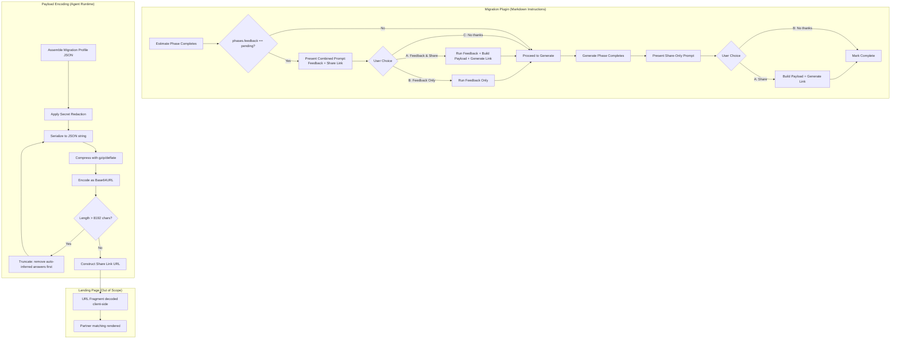

# Design Document: Migration Telemetry Sharing

## Overview

This feature restructures the feedback checkpoints in the GCP-to-AWS migration plugin and adds a "share your plan" mechanism. The share link encodes the user's migration profile into a URL fragment, enabling the AWS Startups landing page to decode it client-side and match users with migration partners — all without any backend or server-side data transmission.

**Key design decisions:**

1. **No backend required** — The URL fragment approach means no server receives the payload during navigation. The landing page decodes entirely in the browser via JavaScript.
2. **Markdown-driven implementation** — The plugin has no Python/scripts. All "code" is agent instructions in markdown reference files. The agent itself performs encoding at runtime using the shell/JavaScript available in Codex, Cursor, Claude Code, and Kiro.
3. **Compression for size management** — JSON → gzip → Base64URL keeps payloads under the 8KB URL limit while preserving rich migration profile data.
4. **Two-checkpoint model** — Feedback + sharing after Estimate (combined), share-only after Generate (no repeated survey).

## Architecture



### File Change Map

| File                                            | Change Type | Description                                                                                                                                    |
| ----------------------------------------------- | ----------- | ---------------------------------------------------------------------------------------------------------------------------------------------- |
| `SKILL.md`                                      | Modify      | Restructure Feedback Checkpoints section: remove post-Discover offer, add combined prompt after Estimate, add share-only prompt after Generate |
| `references/phases/feedback/feedback.md`        | Modify      | Add payload assembly and share link generation steps; update prompt text                                                                       |
| `references/phases/feedback/feedback-trace.md`  | No change   | Trace builder remains as-is (used internally for feedback.json)                                                                                |
| `references/phases/feedback/payload-encoder.md` | **New**     | Payload assembly, secret redaction, compression, Base64URL encoding instructions                                                               |
| `references/phases/estimate/estimate.md`        | Modify      | Update Phase Completion section to invoke combined feedback+share checkpoint                                                                   |
| `references/phases/generate/generate.md`        | Modify      | Update Phase Completion section to invoke share-only checkpoint                                                                                |

## Components and Interfaces

### Component 1: Feedback Checkpoint Controller (SKILL.md)

**Responsibility:** Orchestrates when and how feedback/sharing prompts appear.

**Interface changes to SKILL.md Feedback Checkpoints section:**

```markdown
## Current (to be replaced):

- After Discover: Offer feedback [A] Now / [B] Wait
- After Estimate: Offer feedback [A] Yes / [B] No

## New:

- After Discover: No prompt. Proceed directly to Clarify.
- After Estimate: Combined prompt with 3 options:
  [A] Send feedback & share plan
  [B] Send feedback only\
  [C] No thanks, continue to Generate
- After Generate: Share-only prompt with 2 options:
  [A] Share completed plan
  [B] No thanks, finish
```

### Component 2: Payload Encoder (payload-encoder.md)

**Responsibility:** Assembles the migration profile, redacts secrets, compresses, encodes, and constructs the share link URL.

**Inputs:**

- `$MIGRATION_DIR/preferences.json` — Clarify Q&A answers
- `$MIGRATION_DIR/estimation-infra.json` or `estimation-ai.json` or `estimation-billing.json` — Cost data + recommendation
- `$MIGRATION_DIR/gcp-resource-inventory.json` — Detected GCP services and resource names
- `$MIGRATION_DIR/ai-workload-profile.json` (optional) — AI workload metadata
- `$MIGRATION_DIR/billing-profile.json` (optional) — Billing spend data

**Output:** A Share_Link URL string of the form:

```
https://aws.amazon.com/startups/migrate/connect#<base64url_payload>
```

**Encoding algorithm (executed by the agent at runtime):**

```bash
# Step 1: Agent assembles the JSON payload object (in memory)
# Step 2: Agent serializes to minified JSON string
# Step 3: Agent executes shell command for compression + encoding:
echo '<json_string>' | gzip -c | base64 | tr '+/' '-_' | tr -d '='
# Or equivalently via Node.js:
node -e "const z=require('zlib');const b=z.gzipSync(Buffer.from(JSON.stringify(payload)));console.log(b.toString('base64url'))"
```

### Component 3: Secret Redaction Filter

**Responsibility:** Scans fields in `preferences.json` for known secret patterns before they enter the payload.

**Patterns to match and redact:**

- AWS access key ID: `/AKIA[A-Z0-9]{16}/`
- AWS secret access key: `/[A-Za-z0-9/+=]{40}/` (when in context of a key field)
- Private key headers: `/-----BEGIN .* PRIVATE KEY-----/`
- Connection strings with passwords: `/password=[^&\s]+/i`
- Generic high-entropy strings (>32 chars of mixed alphanumeric) in fields named `*secret*`, `*password*`, `*token*`, `*key*`

**Redaction behavior:** Replace matched values with `"[REDACTED]"`.

### Component 4: Consent Disclosure Template

**Responsibility:** Provides the exact disclosure text shown to users before each share link.

### Component 5: Feedback JSON Recorder

**Responsibility:** Records sharing activity alongside existing feedback data.

**Updated `feedback.json` schema:**

```json
{
  "timestamp": "<ISO 8601>",
  "survey_url": "https://pulse.amazon/survey/MY0ZY7UA?ide=$IDE_TYPE&version=$PLUGIN_VERSION",
  "phases_completed_at_feedback": ["discover", "clarify", "design", "estimate"],
  "trace_included": true,
  "share_link_presented": true,
  "share_link_generated_at": "2026-03-15T10:30:00Z",
  "share_checkpoint": "after_estimate"
}
```

## Data Models

### Payload JSON Schema (v1.0)

```json
{
  "schema_version": "1.0",
  "plugin_version": "<from plugin manifest>",
  "generated_at": "<ISO 8601 UTC>",
  
  "clarify_answers": {
    "<question_id>": {
      "value": "<answer value>",
      "source": "user | inferred | default"
    }
  },
  
  "recommendation": {
    "path": "migrate_optimized | migrate_phased | stay",
    "rationale": "<recommendation rationale text>"
  },
  
  "cost_summary": {
    "current_gcp_monthly": <number>,
    "projected_aws_monthly": <number>,
    "delta": <number>,
    "currency": "USD"
  },
  
  "detected_services": ["google_compute_instance", "google_sql_database_instance", ...],
  
  "resource_names": [
    {"type": "google_sql_database_instance", "name": "prod-db"},
    {"type": "google_compute_instance", "name": "api-server"}
  ],
  
  "workload_types": ["infra", "ai", "billing-only"],
  
  "spend_band": "under-10k | 10k-50k | 50k-100k | over-100k"
}
```

### Spend Band Derivation Logic

| Monthly Spend   | Band Value    |
| --------------- | ------------- |
| < $10,000       | `"under-10k"` |
| $10,000–$49,999 | `"10k-50k"`   |
| $50,000–$99,999 | `"50k-100k"`  |
| ≥ $100,000      | `"over-100k"` |

**Source priority for monthly spend:**

1. `billing-profile.json` → `summary.total_monthly_spend` (if exists)
2. `estimation-infra.json` → `gcp_current_monthly` (if billing profile missing)
3. `estimation-billing.json` → `gcp_current_monthly` (fallback)
4. If no spend data available: `"unknown"`

### Truncation Priority (when payload exceeds 8,192 Base64 chars)

Truncation removes data in this order until the encoded payload fits:

1. **Remove `resource_names` array** — Most verbose, least critical for partner matching
2. **Remove `clarify_answers` where `source == "inferred"`** — Auto-inferred answers are lower value
3. **Remove `clarify_answers` where `source == "default"`** — Defaulted answers next
4. **Remove `recommendation.rationale`** — Keep the path enum, drop the text
5. **Remove `detected_services` beyond first 20** — Truncate long service lists
6. **Never remove:** `schema_version`, `plugin_version`, `generated_at`, `recommendation.path`, `cost_summary`, `workload_types`, `spend_band`

### Size Budget Breakdown (estimated)

| Field                         | Typical Size (JSON chars) | Post-compression (est.) |
| ----------------------------- | ------------------------- | ----------------------- |
| Metadata (version, timestamp) | ~120                      | ~80                     |
| Clarify answers (15-22 Q&A)   | ~2,000–3,500              | ~800–1,400              |
| Recommendation                | ~300                      | ~150                    |
| Cost summary                  | ~150                      | ~80                     |
| Detected services (10-30)     | ~500–1,500                | ~200–600                |
| Resource names (10-50)        | ~500–3,000                | ~200–1,200              |
| Workload types                | ~50                       | ~30                     |
| Spend band                    | ~30                       | ~20                     |
| **Total (typical)**           | **~3,650–8,650**          | **~1,560–3,560**        |
| **Base64 overhead (4/3x)**    | —                         | **~2,080–4,750 chars**  |

Typical payloads will be well under 8KB. Only edge cases with 50+ resources and extensive Clarify answers approach the limit.

### Consent Disclosure Template Text

**After Estimate (combined prompt):**

```
─── Share Your Migration Plan ───

This link encodes your migration profile for partner matching:
✓ Included: Clarify answers, estimated costs, recommendation path,
  detected GCP services, resource names, and workload types.
✗ Excluded: Source code, local file paths, credentials, .tfstate
  contents, and environment secrets.

The link uses a URL fragment (#) — no data is sent to any server
when you click it. The landing page decodes everything client-side.

[A] Send feedback & share plan
[B] Send feedback only
[C] No thanks, continue to Generate
```

**After Generate (share-only prompt):**

```
─── Share Your Completed Plan ───

This link encodes your migration profile for partner matching:
✓ Included: Clarify answers, estimated costs, recommendation path,
  detected GCP services, resource names, and workload types.
✗ Excluded: Source code, local file paths, credentials, .tfstate
  contents, and environment secrets.

The link uses a URL fragment (#) — no data is sent to any server
when you click it. The landing page decodes everything client-side.

[A] Share completed plan
[B] No thanks, finish
```

### Share Link Output Format

When a share link is generated, the plugin outputs:

```
Share link generated:
https://aws.amazon.com/startups/migrate/connect#<base64url_payload>

Copy-paste URL (if the above is not clickable):
https://aws.amazon.com/startups/migrate/connect#<base64url_payload>
```

Both lines contain the identical URL. The duplication ensures usability across terminal environments where auto-link detection may fail.

## Correctness Properties

_A property is a characteristic or behavior that should hold true across all valid executions of a system — essentially, a formal statement about what the system should do. Properties serve as the bridge between human-readable specifications and machine-verifiable correctness guarantees._

### Property 1: Payload Data Completeness

_For any_ set of migration artifacts (preferences.json with N Q&A pairs, an estimation artifact with recommendation path and rationale, a resource inventory with M service types and K resource names), the assembled payload JSON SHALL contain all N Clarify answers, the recommendation rationale, all M distinct service types, and all K resource name/type pairs.

**Validates: Requirements 4.1, 4.3, 4.5, 4.8**

### Property 2: Cost Delta Correctness

_For any_ pair of numeric values (current_gcp_monthly, projected_aws_monthly), the assembled payload's `cost_summary.delta` field SHALL equal `projected_aws_monthly - current_gcp_monthly`.

**Validates: Requirements 4.4**

### Property 3: Spend Band Derivation

_For any_ non-negative monthly spend amount, the derived `spend_band` value SHALL be: `"under-10k"` if spend < 10000, `"10k-50k"` if 10000 ≤ spend < 50000, `"50k-100k"` if 50000 ≤ spend < 100000, and `"over-100k"` if spend ≥ 100000.

**Validates: Requirements 4.7**

### Property 4: Encoding Round-Trip

_For any_ valid Migration_Profile JSON object, compressing with gzip and encoding as Base64URL, then decoding from Base64URL and decompressing with gzip, SHALL produce a JSON object identical to the original.

**Validates: Requirements 5.1**

### Property 5: Size Limit Guarantee

_For any_ Migration_Profile input (regardless of size), the final Base64URL-encoded payload produced by the Payload_Encoder SHALL be at most 8,192 characters in length. When truncation is required, the truncation order SHALL remove `resource_names` first, then `inferred` answers, then `default` answers, then `rationale`, then excess `detected_services` — and the fields `schema_version`, `plugin_version`, `generated_at`, `recommendation.path`, `cost_summary`, `workload_types`, and `spend_band` SHALL never be removed.

**Validates: Requirements 5.3, 5.4**

### Property 6: Secret Redaction

_For any_ `preferences.json` field value that matches a known secret pattern (AWS access key format `AKIA[A-Z0-9]{16}`, private key headers, connection strings with passwords, or high-entropy strings in fields named with secret/password/token/key), the corresponding value in the assembled payload SHALL be `"[REDACTED]"` and SHALL NOT contain the original secret material.

**Validates: Requirements 7.2, 7.3, 7.5, 7.7**

## Error Handling

| Scenario                                                          | Handling                                                                                                                                                                                      |
| ----------------------------------------------------------------- | --------------------------------------------------------------------------------------------------------------------------------------------------------------------------------------------- |
| `preferences.json` missing at share time                          | Skip share link generation. Output: "Cannot generate share link — Clarify phase data not found." Proceed with flow.                                                                           |
| No estimation artifact exists at share time                       | Skip share link generation. Output: "Cannot generate share link — no cost estimate available." Proceed with flow.                                                                             |
| `gcp-resource-inventory.json` missing                             | Assemble payload without `detected_services` and `resource_names` fields (set both to empty arrays).                                                                                          |
| `billing-profile.json` missing AND estimation has no GCP spend    | Set `spend_band` to `"unknown"`.                                                                                                                                                              |
| Compression/encoding command fails                                | Retry once. If still fails, output: "Share link encoding failed. You can still proceed with the migration." Set `share_link_presented: true, share_link_generated_at: null` in feedback.json. |
| Payload exceeds 8,192 chars after all truncation levels exhausted | This should be impossible given the "never remove" fields are ~300 chars. If it occurs, output: "Migration profile too large for URL encoding." and skip share link.                          |
| Plugin manifest unreadable (version detection)                    | Use `"0.0.0"` as `plugin_version`.                                                                                                                                                            |
| `preferences.json` contains malformed JSON                        | Skip share link. Output error. Do not crash the phase.                                                                                                                                        |
| Secret redaction regex causes timeout on pathological input       | Set a 5-second timeout on redaction. If exceeded, skip that field entirely (exclude from payload).                                                                                            |

## Testing Strategy

### Unit Tests (Example-Based)

Unit tests verify specific scenarios and state transitions:

- **Checkpoint flow tests**: Verify that Discover completion produces no feedback prompt; Estimate completion produces combined 3-option prompt; Generate completion produces 2-option share-only prompt.
- **Phase status integration**: Verify `phases.feedback` transitions to `"completed"` for all user choice paths (accept, decline).
- **Consent disclosure content**: Verify disclosure text contains required inclusion/exclusion statements.
- **Output formatting**: Verify share link appears on its own line, as plain text, with label prefix.
- **Schema version fields**: Verify `schema_version`, `plugin_version`, `generated_at` appear with correct values.
- **Spend band boundary cases**: Verify exact boundary values (9999.99 → under-10k, 10000 → 10k-50k, etc.).
- **feedback.json recording**: Verify correct fields are written for each checkpoint scenario.

### Property-Based Tests

Property-based tests verify universal properties across randomly generated inputs. Use **fast-check** (JavaScript/TypeScript) as the PBT library, configured for minimum 100 iterations per property.

Each property test references its design document property:

```
// Feature: migration-telemetry-sharing, Property 1: Payload data completeness
// Feature: migration-telemetry-sharing, Property 2: Cost delta correctness
// Feature: migration-telemetry-sharing, Property 3: Spend band derivation
// Feature: migration-telemetry-sharing, Property 4: Encoding round-trip
// Feature: migration-telemetry-sharing, Property 5: Size limit guarantee
// Feature: migration-telemetry-sharing, Property 6: Secret redaction
```

**Generators needed:**

- `arbitraryPreferences()` — Generates preferences.json with 1–30 Q&A pairs, random answer types (user/inferred/default), random string values including edge cases (unicode, long strings, strings with secret-like patterns).
- `arbitraryEstimation()` — Generates estimation artifacts with random cost values, recommendation paths, and rationale strings.
- `arbitraryResourceInventory()` — Generates resource inventories with 0–100 resources, random GCP type strings and resource names.
- `arbitraryMigrationProfile()` — Composes the above into a full profile for round-trip and size testing.
- `arbitrarySecretValue()` — Generates strings matching known secret patterns (AWS keys, private key headers, connection strings).

### Integration Tests

- **End-to-end encoding verification**: Take a known migration profile, encode it via the shell command (`gzip | base64`), verify the output can be decoded by a reference JavaScript decoder (simulating the landing page).
- **Cross-environment encoding**: Verify that `gzip -c | base64 | tr '+/' '-_' | tr -d '='` and the Node.js `zlib.gzipSync + toString('base64url')` produce identical output for the same input.
- **Real artifact integration**: Use a representative `.migration/` directory with actual phase outputs, run the payload encoder, verify the resulting URL is valid and decodable.
