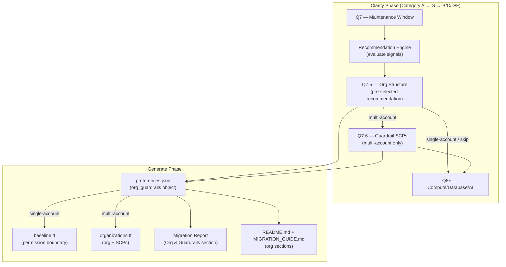

# Design Document: Organization & SCP Support

## Overview

This feature adds organization structure awareness and lightweight Service Control Policy (SCP) support to the migration-to-aws plugin. It introduces a new clarify category (G — Organization & Guardrails), a recommendation engine that computes a tailored organization profile from existing discover/clarify signals, and conditional Terraform generation for AWS Organizations, SCPs, and IAM permission boundaries.

The design follows the plugin's established pattern: markdown reference files instruct the AI agent during each phase, preferences are stored in `preferences.json`, and Terraform is generated conditionally based on those preferences.

### Design Principles

1. **Non-intrusive default**: ~70% of startups get single-account (no org complexity added)
2. **Signal-driven recommendation**: The agent computes a recommendation before presenting the question — the user confirms rather than deciding cold
3. **Isolated artifacts**: `organizations.tf` is self-contained and deletable without affecting other generated files
4. **Shared logic, skill-specific placement**: The recommendation engine and generation logic live in shared references; each skill's clarify/generate orchestrators route to them

## Architecture



### Phase Flow Integration

The feature slots into the existing 6-phase migration flow:

| Phase        | Change                                                                                         |
| ------------ | ---------------------------------------------------------------------------------------------- |
| **Discover** | No changes — signals are read from existing artifacts                                          |
| **Clarify**  | New Category G (Q7.5 + conditional Q7.6) fires after Category A, before B/C/D/F                |
| **Design**   | No changes — org decisions don't affect service-level design                                   |
| **Estimate** | No changes — Organizations/SCPs are free; per-account costs noted in report                    |
| **Generate** | New `organizations.tf` generation; permission boundary in `baseline.tf`; report/docs additions |
| **Feedback** | No changes                                                                                     |

## Components and Interfaces

### New Reference Files

| File                                  | Location                                               | Loaded When                                                                             |
| ------------------------------------- | ------------------------------------------------------ | --------------------------------------------------------------------------------------- |
| `clarify-org.md`                      | `references/phases/clarify/clarify-org.md`             | Category G fires (see firing rules below)                                               |
| `generate-artifacts-org.md`           | `references/phases/generate/generate-artifacts-org.md` | `org_structure` equals "multi-account" OR single-account with security baseline enabled |
| `shared/org-recommendation-engine.md` | `references/shared/org-recommendation-engine.md`       | Loaded by `clarify-org.md` to compute recommendation                                    |

### Modified Reference Files

| File                          | Change                                                                 |
| ----------------------------- | ---------------------------------------------------------------------- |
| `clarify.md` (both skills)    | Add Category G to firing rules table, batch planning, and step 3       |
| `generate-artifacts-infra.md` | Add `organizations.tf` to output structure table                       |
| `generate-artifacts-docs.md`  | Add Organization & Guardrails section to report/README/migration guide |
| `generate.md`                 | Add conditional load of `generate-artifacts-org.md`                    |

### Category G Firing Rules

```
Category G fires WHEN:
  - Migration type is "full" (not AI-only)
  - AND eligible_for_clarify_fast_path == false
  - AND fast-path was not chosen by user

Category G does NOT fire WHEN:
  - AI-only migration (no infrastructure artifacts)
  - Fast-path eligible AND user chose fast-path
  - Heroku skill: fast-path eligible AND user chose fast-path
```

When Category G does not fire, the default `org_structure: "single-account"` is written to `preferences.json` with `chosen_by: "default"`.

### Component: Recommendation Engine (`shared/org-recommendation-engine.md`)

The recommendation engine is a decision table evaluated by the agent before presenting Q7.5. It reads existing discover and clarify signals and assigns one of three profiles.

#### Signal Sources

| Signal                | Artifact                                | Key Path                                                              |
| --------------------- | --------------------------------------- | --------------------------------------------------------------------- |
| Compliance            | `preferences.json`                      | `design_constraints.compliance.value`                                 |
| GCP monthly spend     | `preferences.json`                      | `design_constraints.gcp_monthly_spend.value`                          |
| Migration complexity  | `$MIGRATION_DIR/migration-preview.json` | `complexity_tier` (or computed from `migration-complexity.md` inputs) |
| Workload shape        | `gcp-resource-clusters.json`            | cluster count + AI-only flag                                          |
| Availability          | `preferences.json`                      | `design_constraints.availability.value`                               |
| Fast-path eligibility | `migration-preview.json`                | `eligible_for_clarify_fast_path`                                      |

#### Profile Assignment Algorithm

```
FUNCTION compute_org_recommendation(signals) -> {value, confidence, reasons[]}

  // Profile 3: Defer (rare — needs platform team)
  IF complexity == "Large" AND compliance includes "fedramp":
    RETURN {value: "defer-multi-account", confidence: "high",
            reasons: ["FedRAMP + Large complexity requires dedicated platform team"]}

  IF cluster_count > 6 AND compliance includes ("soc2" OR "pci" OR "hipaa"):
    RETURN {value: "defer-multi-account", confidence: "medium",
            reasons: ["Many workload clusters with compliance suggest full multi-account beyond plugin scope"]}

  // Profile 2: Prod/Dev Split
  IF compliance includes ("soc2" OR "pci" OR "hipaa"):
    reasons.push("Compliance ({value}) benefits from account-level isolation for audit clarity")
    confidence = "high"

  IF spend in ("$5K-$20K") AND has_distinct_prod_nonprod_clusters:
    reasons.push("Spend level and distinct prod/nonprod workloads warrant account separation")
    confidence = MAX(confidence, "medium")

  IF complexity in ("Medium", "Large") AND reasons.length > 0:
    reasons.push("Migration complexity ({tier}) supports isolation narrative")

  IF availability == "multi-az-ha":
    reasons.push("Mission-critical availability supports prod/dev isolation")
    confidence = MAX(confidence, "medium")

  IF reasons.length > 0:
    RETURN {value: "prod-dev-split", confidence, reasons}

  // Profile 1: Single Account (default ~70%)
  reasons = []
  IF complexity == "Small": reasons.push("Simple stack — single account sufficient")
  IF spend in ("<$1K", "$1K-$5K"): reasons.push("Low spend — multi-account overhead not justified")
  IF ai_only: reasons.push("AI-only workloads don't require account isolation")
  IF fast_path_eligible: reasons.push("Fast-path eligible — straightforward migration")

  IF reasons.length == 0:
    reasons.push("No signals indicate multi-account complexity needed")

  RETURN {value: "single-account", confidence: "high", reasons}
```

#### Confidence Levels

| Level    | Meaning                                                                 |
| -------- | ----------------------------------------------------------------------- |
| `high`   | Strong signal alignment — recommendation is clear-cut                   |
| `medium` | Mixed signals — recommendation is reasonable but user input is valuable |
| `low`    | Weak signals — defaulting to simpler option, user judgment preferred    |

### Component: `clarify-org.md` (Category G Questions)

#### Q7.5 — Organization Structure

Presented after Q7 (maintenance window), before compute/database/AI questions. The agent computes the recommendation first, then presents the question with the recommended option pre-selected.

**Question format:**

```markdown
## Q7.5 — Account Structure

**Auto-compute:** Run org-recommendation-engine.md BEFORE presenting this question.
Display the recommendation with plain-language reasons.

**Rationale:** Account structure affects isolation, billing visibility, and compliance posture.
Most early-stage startups (~70%) use a single account successfully.

> Based on your [signals summary], I recommend: **[Profile Name]**
> Reasons: [plain-language reasons from recommendation engine]
>
> A) Use recommendation ([profile name]) — default
> B) Separate prod and dev accounts
> C) Not sure — stick with single account
>
> _This question is optional. Most early-stage startups use a single account._

| Answer | Interpretation                                                                |
| ------ | ----------------------------------------------------------------------------- |
| A      | org_structure = recommendation.value mapped to preferences                    |
| B      | org_structure = "multi-account", user_override = true                         |
| C      | org_structure = "single-account", user_override = true, chosen_by = "default" |
| Skip   | org_structure = "single-account", chosen_by = "default", user_override = true |
```

#### Q7.6 — Guardrail SCP Selection (Conditional)

Only presented when Q7.5 resolves to `org_structure: "multi-account"`.

```markdown
## Q7.6 — Guardrail Policies

**Fires when:** Q7.5 resolved to multi-account (either via recommendation or user override)

**Rationale:** SCPs provide lightweight account-level guardrails without Control Tower.

> Which guardrail policies would you like applied to your organization?
> (Multi-select: choose one or more, or E for none)
>
> A) Deny leaving the organization
> B) Restrict to your target region ([region from Q1])
> C) Deny root user access in member accounts
> D) All of the above — recommended minimal set
> E) None — just the account structure

| Answer | guardrail_scps array                               |
| ------ | -------------------------------------------------- |
| A      | ["deny-leave-org"]                                 |
| B      | ["region-restrict"]                                |
| C      | ["deny-root"]                                      |
| D      | ["deny-leave-org", "region-restrict", "deny-root"] |
| E      | []                                                 |
| A+B    | ["deny-leave-org", "region-restrict"]              |
| A+C    | ["deny-leave-org", "deny-root"]                    |
| B+C    | ["region-restrict", "deny-root"]                   |

Default: D (all three)
```

### Component: `generate-artifacts-org.md` (Terraform Generation)

This file is loaded by `generate.md` during the Generate phase when `org_guardrails` exists in `preferences.json`. It branches based on `org_structure`.

#### Branch 1: Single-Account Path → Permission Boundary in `baseline.tf`

When `org_structure == "single-account"` AND security baseline is not opted out:

- Append an `aws_iam_policy` resource to the end of `baseline.tf`
- Resource name: `${var.project_name}-permission-boundary`
- Policy document denies: `cloudtrail:StopLogging`, `cloudtrail:DeleteTrail`, `guardduty:DeleteDetector`, `guardduty:UpdateDetector`, `iam:DeletePolicy`, `iam:CreatePolicyVersion`, `iam:DeletePolicyVersion` (self-referencing ARN condition)
- Include comment block: "Optional permission boundary — remove before terraform apply if not desired"
- Output the policy ARN as `permission_boundary_arn`

#### Branch 2: Multi-Account Path → `organizations.tf`

When `org_structure == "multi-account"`:

**File structure of `organizations.tf`:**

```hcl
# This file is OPTIONAL. Delete it before terraform apply if you do not want
# AWS Organizations or SCPs. No other generated .tf files reference resources
# defined here.

# --- AWS Organizations ---
resource "aws_organizations_organization" "main" { ... }

# --- Organizational Units ---
resource "aws_organizations_organizational_unit" "production" { ... }
resource "aws_organizations_organizational_unit" "development" { ... }

# --- Member Accounts ---
resource "aws_organizations_account" "production" { ... }
resource "aws_organizations_account" "development" { ... }

# --- SCPs (conditional on guardrail_scps selection) ---
# [deny-leave-org SCP if selected]
# [region-restrict SCP if selected]
# [deny-root SCP if selected]

# --- SCP Attachments ---
# [attachment resources for each SCP → root OU]

# --- Permission Boundary (co-located with org resources) ---
resource "aws_iam_policy" "permission_boundary" { ... }
```

**Resource generation rules:**

1. `aws_organizations_organization`: `feature_set = "ALL"`, `enabled_policy_types = ["SERVICE_CONTROL_POLICY"]`
2. Two OUs: "Production" and "Development" under the root
3. One account per OU with placeholder email `<ou-name-lowercase>@example.com` and TODO comment
4. SCPs generated based on `guardrail_scps` array (0–3 SCPs, never more)
5. Each SCP attached to root OU via `aws_organizations_policy_attachment`
6. No cross-references from other `.tf` files to resources in `organizations.tf`

#### Branch 3: Defer Path (Profile 3)

When recommendation is `"defer-multi-account"` and user accepted:

- Generate NO Terraform organization resources
- Generate an education-only section in the migration report (handled by `generate-artifacts-docs.md`)

### Component: Documentation Generation Additions

Changes to `generate-artifacts-docs.md`:

#### Migration Report — "Organization & Guardrails" Section

Always included regardless of `org_structure`. Contains:

1. **Recommendation summary**: profile name, confidence, reasons
2. **Chosen profile**: what was actually selected, whether user overrode
3. **Override explanation** (if applicable): why recommendation and choice differ
4. **Cost Impact subsection**:
   - Single-account: "No additional cost from org structure"
   - Multi-account: "AWS Organizations and SCPs are free. Per-account baseline services (GuardDuty ~$X/mo, CloudTrail ~$Y/mo, Budgets free) are additional line items per account."
5. **Next Steps subsection**:
   - Single-account: "Revisit account strategy at Series A / first formal audit / $10K/mo spend"
   - Multi-account: "Replace placeholder emails in organizations.tf → run terraform apply for org setup before workload deployment"
   - Defer: "Engage AWS Solutions Architect or platform engineering consultant"

#### Terraform README.md — "Organizations" Section

Added when `organizations.tf` is generated:

- Summary of which resources were generated and why
- Instructions for customizing (e.g., changing region restriction list)
- Instructions for removing (`delete organizations.tf, run terraform plan to confirm no impact`)

#### MIGRATION_GUIDE.md — Multi-Account Additions

Added when `org_structure == "multi-account"`:

- **Workload Deployment Map**: which workloads go to Production account, which to Development
- **Per-Account Baseline Duplication**: GuardDuty, CloudTrail, Budgets explained per account
- **Centralized Services**: Organizations, consolidated billing, SCPs remain in management account
- **When to Revisit**: Series A funding, first compliance audit, $10K/mo spend triggers

### Cross-Skill Integration

Both `gcp-to-aws` and `heroku-to-aws` skills share:

| Component             | Location                                               | Integration Method                                             |
| --------------------- | ------------------------------------------------------ | -------------------------------------------------------------- |
| Recommendation engine | `references/shared/org-recommendation-engine.md`       | Loaded by both skills' `clarify-org.md`                        |
| Org generation logic  | `references/shared/` OR each skill's `generate/`       | Shared file preferred; skill-specific routing in `generate.md` |
| Category G questions  | Each skill: `references/phases/clarify/clarify-org.md` | Identical file content; placed in each skill's directory       |

**GCP-to-AWS integration:**

- `clarify.md` adds Category G to the table (fires between A and B/C/D)
- `generate.md` adds conditional load of `generate-artifacts-org.md`
- Batch planning: Q7.5 and Q7.6 are appended to Batch 1 (Strategic Requirements)

**Heroku-to-AWS integration:**

- `clarify.md` adds Category G after its strategic questions (same position: after region/compliance/spend, before infrastructure)
- `generate.md` adds conditional load of the same generation logic
- Heroku skill has a single `clarify.md` (not split into category files), so org questions are added inline

## Data Models

### Preferences JSON Schema Extension

The `org_guardrails` object is added as a top-level key in `preferences.json`, alongside existing `metadata`, `design_constraints`, and `ai_constraints`:

```json
{
  "metadata": { "..." },
  "design_constraints": { "..." },
  "ai_constraints": { "..." },
  "org_guardrails": {
    "org_structure": "single-account" | "multi-account",
    "guardrail_scps": [],
    "chosen_by": "user" | "default",
    "recommendation": {
      "value": "single-account" | "prod-dev-split" | "defer-multi-account",
      "confidence": "high" | "medium" | "low",
      "reasons": ["Human-readable explanation string"]
    },
    "user_override": false
  }
}
```

#### Field Specifications

| Field                       | Type     | Valid Values                                                    | Default            |
| --------------------------- | -------- | --------------------------------------------------------------- | ------------------ |
| `org_structure`             | string   | `"single-account"`, `"multi-account"`                           | `"single-account"` |
| `guardrail_scps`            | string[] | subset of `{"deny-leave-org", "region-restrict", "deny-root"}`  | `[]`               |
| `chosen_by`                 | string   | `"user"`, `"default"`                                           | `"default"`        |
| `recommendation.value`      | string   | `"single-account"`, `"prod-dev-split"`, `"defer-multi-account"` | —                  |
| `recommendation.confidence` | string   | `"high"`, `"medium"`, `"low"`                                   | —                  |
| `recommendation.reasons`    | string[] | 1+ human-readable strings                                       | —                  |
| `user_override`             | boolean  | `true`, `false`                                                 | `true`             |

#### Invariants

1. When `org_structure == "single-account"` → `guardrail_scps` MUST be `[]`
2. When `org_structure == "multi-account"` → `guardrail_scps` contains 0–3 items from the valid set, no duplicates
3. `user_override == false` only when user selected option A (accept recommendation)
4. `recommendation` object is always present (computed before question is shown)
5. No field may contain a value outside its defined valid set — write must be rejected with error

#### Mapping: Recommendation Value → org_structure

| recommendation.value    | org_structure written                                    |
| ----------------------- | -------------------------------------------------------- |
| `"single-account"`      | `"single-account"`                                       |
| `"prod-dev-split"`      | `"multi-account"`                                        |
| `"defer-multi-account"` | `"single-account"` (no Terraform, education-only report) |

Note: Profile 3 ("defer") maps to `org_structure: "single-account"` because no organization Terraform is generated. The distinction is preserved in `recommendation.value` for report generation.

### SCP Policy Documents

Each SCP is a JSON policy document that must not exceed 5,120 bytes.

#### SCP: Deny Leave Organization

```json
{
  "Version": "2012-10-17",
  "Statement": [
    {
      "Sid": "DenyLeaveOrg",
      "Effect": "Deny",
      "Action": "organizations:LeaveOrganization",
      "Resource": "*"
    }
  ]
}
```

#### SCP: Region Restriction

```json
{
  "Version": "2012-10-17",
  "Statement": [
    {
      "Sid": "DenyOutsideTargetRegion",
      "Effect": "Deny",
      "NotAction": [
        "iam:*",
        "route53:*",
        "route53domains:*",
        "cloudfront:*",
        "organizations:*",
        "sts:*",
        "support:*",
        "budgets:*",
        "wafv2:*",
        "shield:*",
        "health:*"
      ],
      "Resource": "*",
      "Condition": {
        "StringNotEquals": {
          "aws:RequestedRegion": ["${target_region}"]
        }
      }
    }
  ]
}
```

#### SCP: Deny Root User Access

```json
{
  "Version": "2012-10-17",
  "Statement": [
    {
      "Sid": "DenyRootUserActions",
      "Effect": "Deny",
      "Action": "*",
      "Resource": "*",
      "Condition": {
        "StringLike": {
          "aws:PrincipalArn": "arn:aws:iam::*:root"
        }
      }
    }
  ]
}
```

Note: The deny-root SCP as generated is intentionally simple. The comment block in Terraform will list root-required exceptions (password recovery, account closure, MFA management) and instruct users to add `NotAction` entries if they need those capabilities in member accounts.

### Permission Boundary Policy Document

Applied in single-account path (appended to `baseline.tf`):

```json
{
  "Version": "2012-10-17",
  "Statement": [
    {
      "Sid": "DenySecurityBaselineDisruption",
      "Effect": "Deny",
      "Action": [
        "cloudtrail:StopLogging",
        "cloudtrail:DeleteTrail",
        "guardduty:DeleteDetector",
        "guardduty:UpdateDetector",
        "iam:DeletePolicy",
        "iam:CreatePolicyVersion",
        "iam:DeletePolicyVersion"
      ],
      "Resource": "*",
      "Condition": {
        "ArnEquals": {
          "aws:PrincipalArn": "${self_arn}"
        }
      }
    }
  ]
}
```

The `iam:DeletePolicy`, `iam:CreatePolicyVersion`, and `iam:DeletePolicyVersion` actions are scoped via a resource condition to the permission boundary policy's own ARN — preventing users from modifying the boundary itself while still allowing normal IAM policy management.

## Error Handling

### Preferences JSON Validation

When writing `org_guardrails` to `preferences.json`:

1. **Invalid field value**: If any field contains a value outside its defined valid set, the agent MUST reject the write, surface an error message naming the invalid field and value, and leave the prior `preferences.json` unchanged.

2. **Missing recommendation**: If the recommendation engine cannot compute a profile (e.g., required signals missing), default to `{value: "single-account", confidence: "low", reasons: ["Insufficient signals — defaulting to single account"]}`.

3. **Conflicting state**: If `org_structure == "single-account"` but `guardrail_scps` is non-empty, the agent MUST clear `guardrail_scps` to `[]` and log a warning.

### Terraform Generation Validation

1. **SCP size check**: Each SCP policy JSON document must be validated to not exceed 5,120 bytes before emission. If the region-restriction SCP with all global service exceptions approaches the limit, the agent should warn and suggest reducing the exception list.

2. **No cross-file references**: The agent MUST NOT generate `terraform_remote_state`, `data` sources, or resource references in other `.tf` files that point to resources defined in `organizations.tf`. This ensures the file is safely deletable.

3. **Email placeholders**: All generated `aws_organizations_account` resources MUST use placeholder emails and include TODO comments. The agent MUST NOT prompt for real email addresses during generation.

### Graceful Degradation

| Failure Mode                                            | Behavior                                                   |
| ------------------------------------------------------- | ---------------------------------------------------------- |
| Recommendation engine signals unavailable               | Default to Profile 1, confidence "low"                     |
| User skips Q7.5 entirely                                | Apply single-account default, no follow-up questions       |
| preferences.json write fails validation                 | Surface error, do not advance phase                        |
| Generate phase: org_guardrails missing from preferences | Skip org artifact generation, proceed with other artifacts |

## Correctness Properties

This feature produces markdown steering files and Terraform IaC rather than executable functions. Traditional property-based testing (random input generation → property assertion) does not apply. The following correctness properties are instead validated through schema checks, terraform validate, and integration test scenarios:

### Property 1: Profile Determinism

Given identical discover/clarify signals, the recommendation engine MUST always produce the same profile assignment (value + confidence + reasons). No randomness or session-dependent state influences the result.

**Validates: Requirements 9.1, 9.2**

### Property 2: Schema Invariant — SCP Emptiness

When `org_structure == "single-account"`, the `guardrail_scps` array MUST always be empty. No code path may produce a non-empty SCP array with single-account structure.

**Validates: Requirements 8.5**

### Property 3: Artifact Isolation

No resource in `organizations.tf` may be referenced by any other generated `.tf` file. Deleting `organizations.tf` MUST NOT cause `terraform plan` to report errors on remaining files.

**Validates: Requirements 6.1**

### Property 4: SCP Size Bound

Every generated SCP policy JSON document MUST be ≤ 5,120 bytes. This is an AWS hard limit.

**Validates: Requirements 5.8**

### Property 5: SCP Count Bound

The total number of generated `aws_organizations_policy` resources MUST be ≤ 3. No code path may produce a fourth SCP.

**Validates: Requirements 5.9**

### Property 6: Recommendation Completeness

The `recommendation` object in `org_guardrails` MUST always have a `value` (from the valid set), `confidence` (from the valid set), and at least one entry in `reasons[]`. Missing recommendation state is a write-rejection error.

**Validates: Requirements 8.3**

### Property 7: Profile-Artifact Alignment

Profile 1 (single-account) → permission boundary only, no organizations.tf. Profile 2 (prod-dev-split) → organizations.tf with OUs and optional SCPs. Profile 3 (defer) → no Terraform org resources, report section only. No cross-contamination between profiles.

**Validates: Requirements 3.2, 4.4, 9.6**

## Testing Strategy

### Why Property-Based Testing Does Not Apply

This feature is a set of **markdown reference files that instruct an AI agent** and **Terraform IaC output**. The "code" being produced is:

1. **Markdown steering documents** — not executable functions
2. **Terraform configurations** — declarative IaC (appropriate for snapshot/plan validation, not PBT)
3. **JSON schema extensions** — validated via schema checks, not computation
4. **Decision table logic** — evaluated by the agent at runtime from signals, not a callable function

Property-based testing requires a pure function with inputs/outputs that can be exercised across a random input space. None of the components in this feature meet that criterion. The appropriate testing strategies are:

- **Terraform validation**: `terraform validate` and `terraform plan` on generated output
- **Schema validation**: JSON Schema checks on the `org_guardrails` object
- **Snapshot testing**: Compare generated Terraform against known-good baselines
- **Integration testing**: End-to-end runs through the agent with controlled inputs

### Test Approach

#### 1. Terraform Validation Tests

Run `terraform validate` on generated `organizations.tf` and `baseline.tf` (with permission boundary) to confirm syntactic correctness.

**Test scenarios:**

- Multi-account with all 3 SCPs → valid `organizations.tf`
- Multi-account with no SCPs (option E) → valid `organizations.tf` (no SCP resources)
- Single-account with security baseline → valid `baseline.tf` with permission boundary appended
- Single-account with security baseline opted out → no permission boundary generated

#### 2. Schema Validation Tests

Validate `preferences.json` output against a JSON Schema definition for `org_guardrails`:

- All required fields present
- `org_structure` only contains valid enum values
- `guardrail_scps` contains no duplicates and only valid values
- `guardrail_scps` is empty when `org_structure == "single-account"`
- `recommendation` object has all three required fields
- `recommendation.reasons` has at least one entry

#### 3. Recommendation Engine Logic Tests

Manual verification matrix — test each signal combination against expected profile assignment:

| Signals                                                   | Expected Profile    | Confidence |
| --------------------------------------------------------- | ------------------- | ---------- |
| Small complexity, no compliance, <$5K spend               | single-account      | high       |
| SOC2 compliance, $8K spend, Medium complexity             | prod-dev-split      | high       |
| HIPAA compliance, <$1K spend, Small complexity            | prod-dev-split      | high       |
| FedRAMP compliance, Large complexity                      | defer-multi-account | high       |
| No compliance, $12K spend, distinct prod/nonprod clusters | prod-dev-split      | medium     |
| AI-only workloads                                         | single-account      | high       |
| Fast-path eligible                                        | single-account      | high       |

#### 4. SCP Policy Size Validation

Each SCP JSON document must be checked to not exceed 5,120 bytes:

- Deny-leave-org: ~150 bytes ✓
- Region-restrict: ~600 bytes (varies by global service exception count) ✓
- Deny-root: ~200 bytes ✓

#### 5. Integration Tests (Agent-Level)

End-to-end scenarios running the full clarify → generate flow with controlled discovery artifacts:

- **Scenario A**: Simple stack (fast-path) → verify org question is skipped, default applied
- **Scenario B**: Medium complexity + SOC2 → verify recommendation is prod-dev-split, organizations.tf generated
- **Scenario C**: User overrides recommendation → verify user_override = true, correct artifacts generated
- **Scenario D**: Multi-account + all SCPs → verify 3 SCP resources + 3 attachments in organizations.tf
- **Scenario E**: Defer profile → verify no Terraform, education section in report

#### 6. Cross-File Isolation Test

After generating all Terraform, run:

```bash
grep -l "organizations\." terraform/*.tf | grep -v organizations.tf
```

Should return empty — no other `.tf` file references resources in `organizations.tf`.
