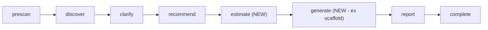
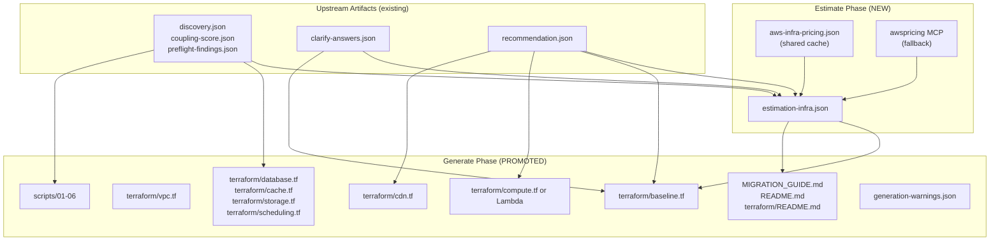

# Design Document: Vercel-to-AWS Generate Phase Parity

## Overview

This design promotes the `vercel-to-aws` skill from assessment-only (with an optional scaffold checkpoint) to full migration artifact generation at parity with the `heroku-to-aws` skill. Two new mandatory backbone phases are added (`estimate` and `generate`), the `report` phase is repositioned after generation, and the existing `scaffold` checkpoint is retired.

### Design Principles

1. **Reuse shared infrastructure.** The estimate phase uses `estimation-infra.schema.json`, `aws-infra-pricing.json`, and `complexity-tiers.json` from `skills/shared/` — no Vercel-specific forks.
2. **Outcome drives generation scope.** The generate phase respects the Recommendation Engine's output: Outcome A (SST+Terraform), Outcome B (Terraform-only Fargate), Outcome C (Terraform-only backend), stay (baseline+peripherals only).
3. **Security baseline is unconditional.** `baseline.tf` is emitted regardless of outcome — identical content to the GCP skill's baseline, parameterized by compliance answers.
4. **Assessment remains the anchor.** The report still carries the honest assessment (Coupling Score, Pre-Flight Checks, Confidence_Tier). The generate phase adds actionable artifacts alongside it, not instead of it.
5. **DSL-native from day one.** Both new phases use the phase DSL (frontmatter + INTERPRETER.md), matching `heroku-to-aws`'s architecture.

## Architecture

### New Phase Backbone

```
prescan -> discover -> clarify -> recommend -> estimate -> generate -> report -> complete
```

Changes from current:

- `estimate` inserted between `recommend` and `report` (new)
- `generate` inserted between `estimate` and `report` (promoted from `scaffold` checkpoint)
- `report` moves to after `generate` (was after `recommend`)
- `scaffold` checkpoint retired (its logic absorbed into `generate`)



### Data Flow



## Phase Designs

### Estimate Phase (`references/phases/estimate/`)

| Property          | Value                                                                                                                                                 |
| ----------------- | ----------------------------------------------------------------------------------------------------------------------------------------------------- |
| `_phase`          | `estimate`                                                                                                                                            |
| `_requires_phase` | `recommend`                                                                                                                                           |
| `_advances_to`    | `generate`                                                                                                                                            |
| `_interactive`    | `false`                                                                                                                                               |
| `_exec`           | `{ _agent: rw }`                                                                                                                                      |
| Inputs            | `recommendation.json`, `discovery.json`, `clarify-answers.json`, `coupling-score.json`                                                                |
| Produces          | `estimation-infra.json`                                                                                                                               |
| Knowledge         | `skills/shared/pricing/aws-infra-pricing.json`, `skills/shared/estimate/complexity-tiers.json`, `skills/shared/estimate/estimation-infra.schema.json` |

#### Fragment: `estimate-cost-engine.md`

Single fragment (always fires). Computes:

1. **Current Vercel costs** (best available source):
   - Priority 1: Vercel API `usage_metrics` from `discovery.json` (if present)
   - Priority 2: User-provided spend from `clarify-answers.json` (Clarify extension question)
   - Priority 3: Plan-based estimation (Pro = ~$20/member/mo + usage; Enterprise = user-provided)
   - Priority 4: Unavailable (present AWS costs without comparison)

2. **Projected AWS costs** per outcome:
   - **Outcome A (OpenNext/SST):** Lambda (server function), CloudFront, S3 (static assets + ISR cache), EventBridge (revalidation queue), peripherals
   - **Outcome B (Fargate):** ECS Fargate tasks, ALB, CloudFront, ECR, NAT Gateway, peripherals
   - **Outcome C (Hybrid backend):** Lambda + API Gateway OR Fargate (per `backend_shape`), peripherals only (app stays on Vercel — its cost continues)
   - **"stay":** Peripheral costs only (baseline is free-tier eligible for most controls)

3. **Three-tier modeling:**
   - **Premium:** Multi-AZ, higher instance classes, provisioned IOPS on databases, dedicated NAT per AZ
   - **Balanced:** Default posture — single NAT, standard instance classes, GP3 storage
   - **Optimized:** Graviton across the board, Spot for non-critical tasks, S3 Intelligent-Tiering, reserved capacity where applicable

4. **Complexity classification** using `complexity-tiers.json` thresholds

5. **Recommendation path:** `migrate_optimized` (clear cost win), `migrate_phased` (cost-neutral but other benefits), or `stay` (cost increase with no compelling offset)

#### Assembler: `estimate-assemble.md`

Writes `estimation-infra.json`, validates against schema, runs Property-16 arithmetic check, runs postconditions, emits `HANDOFF_OK`.

### Generate Phase (`references/phases/generate/`)

| Property          | Value                                                                                                                                      |
| ----------------- | ------------------------------------------------------------------------------------------------------------------------------------------ |
| `_phase`          | `generate`                                                                                                                                 |
| `_requires_phase` | `estimate`                                                                                                                                 |
| `_advances_to`    | `report`                                                                                                                                   |
| `_interactive`    | `false`                                                                                                                                    |
| `_exec`           | `{ _agent: rw }`                                                                                                                           |
| Inputs            | `recommendation.json`, `estimation-infra.json`, `discovery.json`, `preflight-findings.json`, `coupling-score.json`, `clarify-answers.json` |
| Produces          | See file table below                                                                                                                       |
| Knowledge         | `knowledge/peripheral-mappings.json`, `references/shared/graviton.md`                                                                      |

#### Fragments

| Fragment ID        | Trigger                                                                             | File                      | Contributes                                                                                                                                                                      |
| ------------------ | ----------------------------------------------------------------------------------- | ------------------------- | -------------------------------------------------------------------------------------------------------------------------------------------------------------------------------- |
| `baseline`         | `_always: true`                                                                     | `generate-baseline.md`    | `terraform/baseline.tf`, `terraform/main.tf` (partial: backend block)                                                                                                            |
| `terraform`        | `_always: true`                                                                     | `generate-terraform.md`   | `terraform/main.tf`, `terraform/variables.tf`, `terraform/outputs.tf`, `terraform/vpc.tf`, `terraform/security.tf`, `terraform/.gitignore`, `terraform/terraform.tfvars.example` |
| `compute-opennext` | `recommendation.outcome == 'A'`                                                     | `generate-opennext.md`    | `sst.config.ts`, `terraform/cdn.tf` (CloudFront for SST)                                                                                                                         |
| `compute-fargate`  | `recommendation.outcome == 'B' OR (outcome == 'C' AND backend_shape == 'B-shaped')` | `generate-fargate.md`     | `terraform/compute.tf`, `terraform/cdn.tf`                                                                                                                                       |
| `compute-lambda`   | `recommendation.outcome == 'C' AND backend_shape == 'A-shaped'`                     | `generate-lambda.md`      | `terraform/compute.tf` (API Gateway + Lambda)                                                                                                                                    |
| `peripherals`      | `_always: true`                                                                     | `generate-peripherals.md` | `terraform/database.tf`, `terraform/cache.tf`, `terraform/storage.tf`, `terraform/scheduling.tf` (conditional per peripheral)                                                    |
| `scripts`          | `_always: true`                                                                     | `generate-scripts.md`     | `scripts/01-06*.sh`                                                                                                                                                              |
| `docs`             | `_always: true`                                                                     | `generate-docs.md`        | `MIGRATION_GUIDE.md`, `README.md`, `terraform/README.md`                                                                                                                         |

#### Assembler: `generate-assemble.md`

Validates mutual exclusion (at most one compute fragment), confirms `baseline.tf` exists, confirms no `{{PLACEHOLDER}}` tokens, writes `generation-warnings.json`, runs postconditions, emits `HANDOFF_OK`.

### Output Files (Generate Phase)

| File                                   | Domain      | Emitted When                             |
| -------------------------------------- | ----------- | ---------------------------------------- |
| `terraform/main.tf`                    | core        | Always                                   |
| `terraform/variables.tf`               | core        | Always                                   |
| `terraform/outputs.tf`                 | core        | Always                                   |
| `terraform/baseline.tf`                | security    | Always                                   |
| `terraform/vpc.tf`                     | networking  | Always (Vercel has no VPC equivalent)    |
| `terraform/security.tf`                | security    | Always (IAM + security groups)           |
| `terraform/compute.tf`                 | compute     | When Outcome B or C (Fargate or Lambda)  |
| `terraform/cdn.tf`                     | CDN         | When Outcome A or B (CloudFront)         |
| `terraform/database.tf`                | database    | When Postgres peripheral detected        |
| `terraform/cache.tf`                   | cache       | When KV peripheral detected              |
| `terraform/storage.tf`                 | storage     | When Blob peripheral detected            |
| `terraform/scheduling.tf`              | scheduling  | When Cron peripheral detected            |
| `terraform/.gitignore`                 | core        | Always                                   |
| `terraform/terraform.tfvars.example`   | core        | Always                                   |
| `terraform/README.md`                  | docs        | Always                                   |
| `sst.config.ts`                        | app surface | Only Outcome A full-app mode             |
| `scripts/01-validate-prerequisites.sh` | migration   | Always                                   |
| `scripts/02-migrate-secrets.sh`        | migration   | Always (Vercel env vars always exist)    |
| `scripts/03-migrate-database.sh`       | migration   | When Postgres peripheral detected        |
| `scripts/04-build-and-push.sh`         | migration   | When Outcome B (container build needed)  |
| `scripts/05-dns-cutover.sh`            | migration   | When Outcome A or B (full-app migration) |
| `scripts/06-validate-migration.sh`     | migration   | Always                                   |
| `MIGRATION_GUIDE.md`                   | docs        | Always                                   |
| `README.md`                            | docs        | Always                                   |
| `generation-warnings.json`             | meta        | Always (empty when clean)                |

### Baseline.tf Content (Requirement 3)

Identical structure to the GCP skill's `baseline.tf` (Step 1.5 of `generate-artifacts-infra.md`), parameterized for Vercel:

1. **Always-on resources:** alternate contacts, password policy, S3 PAB, EBS encryption, Access Analyzer, IMDSv2 defaults, CloudTrail + log bucket, budget alert, GuardDuty
2. **Remote-state backend:** S3 bucket + DynamoDB lock table
3. **Compliance-conditional section** (when Clarify compliance answer present): Config recorder, Security Hub + standards
4. **Source tag:** `Source = "vercel-to-aws"` (instead of `"gcp-to-aws"`)

### Clarify Phase Extension

Add three new questions to the existing `clarify-ask.md` question set:

| Question                             | ID              | Skip When                                           | Design Consequence                     |
| ------------------------------------ | --------------- | --------------------------------------------------- | -------------------------------------- |
| Approximate monthly Vercel spend     | `vercel_spend`  | Vercel API returned usage metrics with billing data | Feeds `current_costs` in estimate      |
| Database size (if Postgres detected) | `database_size` | Not detected                                        | Drives pg_dump vs DMS selection        |
| Compliance requirements              | `compliance`    | Already answered in another context                 | Drives baseline.tf conditional section |

### Report Phase Changes

The report phase (`_requires_phase`) changes from `recommend` to `generate`. The report now:

- References cost data from `estimation-infra.json`
- References generated artifacts as deliverables
- Removes the "Optional: Generate IaC Scaffold" prompt (generation already happened)
- Adds a "Cost Comparison" section (Vercel current vs. AWS projected)
- Adds an "Artifacts Generated" section listing what's in `terraform/` and `scripts/`

### SKILL.md Changes

- Backbone updated: `prescan` -> `discover` -> `clarify` -> `recommend` -> `estimate` -> `generate` -> `report` -> `complete`
- Remove the "Scaffold Checkpoint" section entirely
- Remove the Philosophy bullet "Assessment is the durable value, not scaffolding" — generation is now a first-class deliverable
- Update the File Structure tree to reflect new phases/files
- Add a "Breaking Change" note about incompatibility with pre-upgrade `.phase-status.json`

## Resolved Design Decisions

1. **Report AFTER generate, not before.** In the current skill, report runs before scaffold (assessment-first philosophy). With generate promoted to mandatory, report moves after so it can reference actual artifacts and cost estimates. This matches Heroku's flow where generate precedes the final output.

2. **No separate "design" phase.** Unlike Heroku (which has discover -> clarify -> design -> estimate -> generate), the Vercel skill collapses "design" into the Recommendation Engine. The recommendation outcome + peripheral mappings ARE the design — there's no intermediate `aws-design.json`. The estimate and generate phases read `recommendation.json` + `discovery.json` directly. This is simpler and appropriate because Vercel migrations have fewer service combinations than Heroku.

3. **SST exception survives.** Outcome A still uses SST/OpenNext for the app surface. This is the correct tool for Next.js on AWS, and wrapping it in Terraform would produce worse output. The exception is now narrower: EVERYTHING else (baseline, VPC, peripherals, security, scripts, docs) is production-ready Terraform. Only the app-hosting surface uses SST.

4. **Outcome "stay" still generates something.** Even a "stay" recommendation produces `baseline.tf` (security baseline is always valuable) and peripheral Terraform (the founder might carve off a Blob->S3 migration even while staying on Vercel for compute). Scripts are limited to prerequisites + secrets migration.

5. **Vercel cost estimation is best-effort.** Vercel's pricing is opaque (usage-based, not published per-resource like Heroku). The estimate phase does its best with API data and user input, but honestly labels low-confidence baselines. This is acceptable — the valuable comparison is "what AWS will cost" (precise) vs "what Vercel costs" (best-effort).

## Files to Create

| File                                                 | Purpose                                                           |
| ---------------------------------------------------- | ----------------------------------------------------------------- |
| `references/phases/estimate/estimate.md`             | Phase orchestrator                                                |
| `references/phases/estimate/estimate-cost-engine.md` | Cost computation fragment                                         |
| `references/phases/estimate/estimate-assemble.md`    | Assembler + validation                                            |
| `references/phases/generate/generate.md`             | Phase orchestrator                                                |
| `references/phases/generate/generate-baseline.md`    | baseline.tf fragment                                              |
| `references/phases/generate/generate-terraform.md`   | Core Terraform fragment (main, variables, outputs, vpc, security) |
| `references/phases/generate/generate-opennext.md`    | Outcome A compute fragment (SST/OpenNext)                         |
| `references/phases/generate/generate-fargate.md`     | Outcome B/C-B compute fragment                                    |
| `references/phases/generate/generate-lambda.md`      | Outcome C-A compute fragment (API Gateway + Lambda)               |
| `references/phases/generate/generate-peripherals.md` | Peripheral Terraform fragment                                     |
| `references/phases/generate/generate-scripts.md`     | Migration scripts fragment                                        |
| `references/phases/generate/generate-docs.md`        | Documentation fragment                                            |
| `references/phases/generate/generate-assemble.md`    | Assembler + validation                                            |

## Files to Modify

| File                                        | Change                                                                        |
| ------------------------------------------- | ----------------------------------------------------------------------------- |
| `SKILL.md`                                  | New backbone, remove scaffold checkpoint section, update file tree            |
| `references/phases/clarify/clarify-ask.md`  | Add 3 new questions                                                           |
| `references/phases/report/report.md`        | Change `_requires_phase` to `generate`, add cost/artifact sections            |
| `references/phases/report/report-render.md` | Incorporate cost data and artifact references                                 |
| `references/vendored/`                      | Vendor `estimate/` schemas and `pricing/` cache (already vendored for heroku) |

## Files to Delete

| File                                                 | Reason                                        |
| ---------------------------------------------------- | --------------------------------------------- |
| `references/phases/scaffold/scaffold.md`             | Replaced by `generate.md`                     |
| `references/phases/scaffold/scaffold-opennext.md`    | Logic absorbed into `generate-opennext.md`    |
| `references/phases/scaffold/scaffold-fargate.md`     | Logic absorbed into `generate-fargate.md`     |
| `references/phases/scaffold/scaffold-peripherals.md` | Logic absorbed into `generate-peripherals.md` |
| `references/phases/scaffold/scaffold-assemble.md`    | Logic absorbed into `generate-assemble.md`    |

## Vendoring Changes

The following shared files need to be vendored into `references/vendored/` (matching heroku-to-aws's pattern):

| Canonical Source                                      | Vendored Location                                           |
| ----------------------------------------------------- | ----------------------------------------------------------- |
| `skills/shared/pricing/aws-infra-pricing.json`        | `references/vendored/pricing/aws-infra-pricing.json`        |
| `skills/shared/estimate/estimation-infra.schema.json` | `references/vendored/estimate/estimation-infra.schema.json` |
| `skills/shared/estimate/complexity-tiers.json`        | `references/vendored/estimate/complexity-tiers.json`        |

Register in `tools/sync-vendored-shared.ts` for CI byte-identity enforcement.

## Risk and Mitigation

| Risk                               | Mitigation                                                                                       |
| ---------------------------------- | ------------------------------------------------------------------------------------------------ |
| Vercel spend estimation inaccuracy | Honest confidence labeling; always present AWS cost even when Vercel baseline unavailable        |
| Breaking existing assessments      | Document as breaking; re-run from prescan is acceptable for a pre-1.0 skill                      |
| SST/OpenNext version drift         | Generate phase references current version; `terraform/README.md` carries upgrade guidance        |
| Estimate phase adds latency        | MCP is fallback-only; cached pricing covers all common services (no network calls in happy path) |
